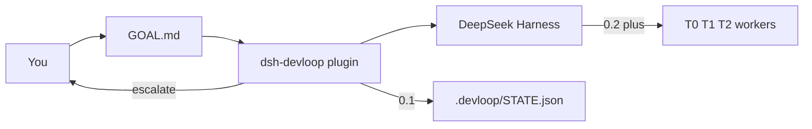
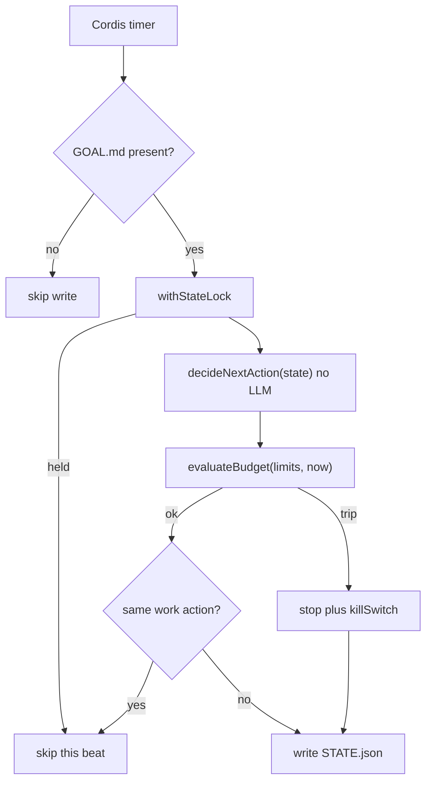
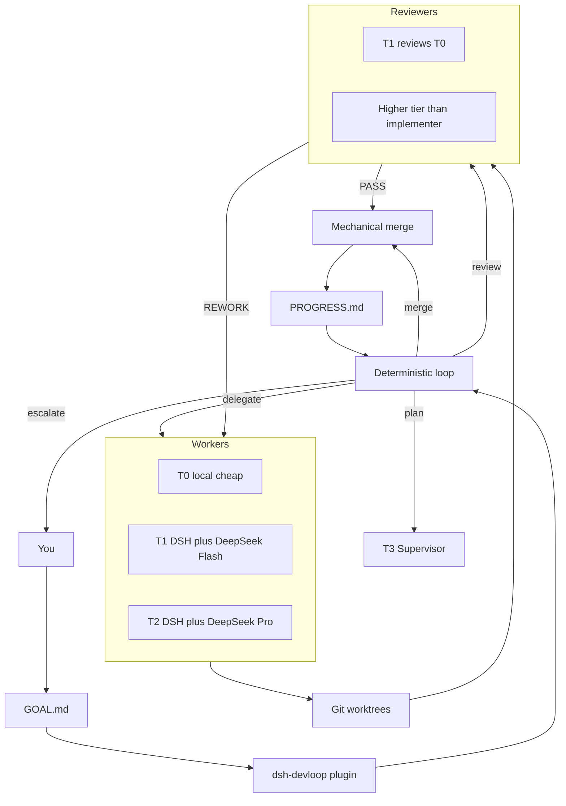

# DevLoop

DeepSeek Harness plugin: **expensive models plan and review, cheap models implement, a program loop keeps the factory inside budget.**

This repository is `dsh-devloop`. It is not another coding agent and it does not fork DSH core. Design and decisions: [`docs/`](./docs/).

## What 0.1 does

- Installs into a DSH profile as a bundle plugin
- On each tick, if the workspace has `.devloop/GOAL.md`, reads `STATE.json` and records the next loop action (plan / delegate / review / merge / stop)
- Enforces budget / circuit-breaker rules in-process
- Does **not** spawn DeepSeek / Claude / Codex workers or create git worktrees
- 0.2.1: after writing STATE, plan / delegate / review is handed to `AgentBackend.run` (recording no-op, outside the lock)

## How it fits



Harness is the agent runtime. This plugin is the engineering scheduler. 0.1 writes the next action; it does not run the workers yet.

## 0.1 tick (what ships now)



`decideNextAction` only sees state. Cost / timeout / attempt caps are applied afterwards in `runTick`, so a budget trip can rewrite any intended action into `stop`.

## Target factory (0.2 and later)



Until 0.2, `delegate` / `review` / `merge` are recorded in `STATE.json` only. No worktree, no headless agent, no merge.

## Can 0.1 meet the product goal?

The goal is: expensive models plan and review, cheap models implement, a program loop keeps the factory inside budget.

| Goal slice | 0.1 |
|---|---|
| DSH plugin, not a new runtime | Yes. Bundle + Cordis Service. |
| Program loop, one transition per tick | Yes. Pure `decideNextAction` plus `runTick`. |
| Hard budget / kill switch | Yes, in-process. No live token/cost feed yet. |
| File-backed recoverability | Partial. `GOAL.md` + `STATE.json` + `LOCK`. No PLAN / PROGRESS / runs yet. |
| Cheap workers actually implement | **No.** 0.2. |
| Expensive models actually review | **No.** 0.2. |
| Unattended milestone completion | **No.** 0.3. |

0.1 is the installable scheduler core. It can be loaded, armed, and proven to stop. It cannot yet turn a GOAL into merged code.

## Requirements

- Node `^22.19.0 || >=24.0.0` (DSH engines; Node 23 is not in the Harness range)
- pnpm
- DeepSeek Harness CLI (`npm i -g @deepseek-ai/dsh` or `pnpm dsh` from a harness checkout)
- A working `dsh web` (or any profile you want the plugin in)

## Build

```bash
pnpm install
pnpm test
pnpm build
```

Git installs run `prepare` → `pnpm build`, so the published entry is `lib/`.

## Install into DSH

From this checkout (after `pnpm build`):

```bash
dsh plugin --profile web add /absolute/path/to/DevLoop
```

Restart the profile:

```bash
dsh web
```

Confirm the layer is composed:

```bash
dsh --profile web --dump-config | grep -A2 devloop
```

You should see a `# == dsh-devloop` layer and an inserted row `id: devloop`.

Optional overrides in `~/.dsh/profiles/web/cordis.patch.yml`:

```yaml
- id: devloop
  config:
    root: /path/to/your/project
    tickIntervalMs: 2000
    budget:
      maxCostUsdPerDay: 20
```

## Arm a project

The plugin is idle until the target workspace contains `.devloop/`:

```bash
mkdir -p /path/to/your/project/.devloop
cp templates/GOAL.md /path/to/your/project/.devloop/GOAL.md
# edit GOAL.md, then start dsh from that project (or set config.root)
```

Each tick writes `.devloop/STATE.json` with `lastAction`. 0.1 stops at recording; it does not edit your source tree.

## Uninstall

```bash
dsh plugin --profile web remove dsh-devloop
```

## Reference implementations (not vendored)

Local clones used while writing 0.1 (outside this repo):

- `deepseek-ai/deepseek-harness` — plugin / bundle API
- `H97y/dsh-devflow` — winner reference for tick + worktree + pipeline ideas

We rebuild; we do not copy that product’s requirement-pool model.

## License

Apache-2.0. DSH and `dsh-devflow` are MIT; we depend on their public plugin API only.
