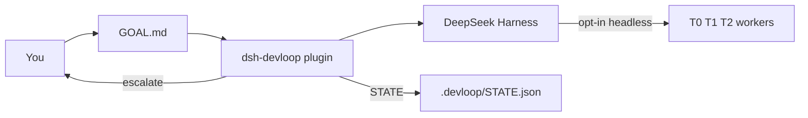
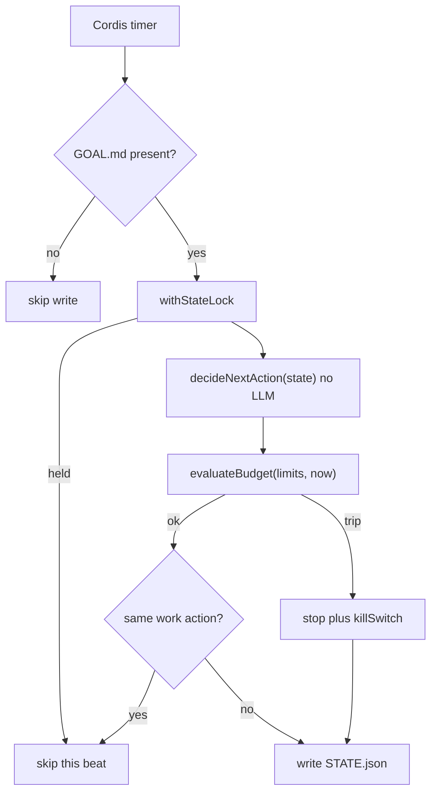
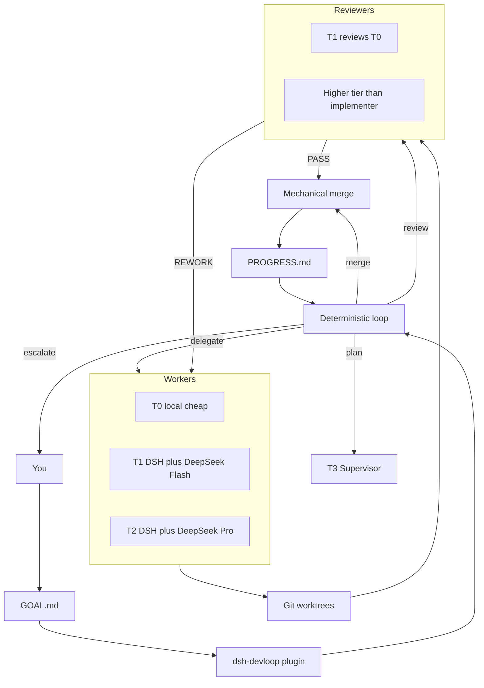

# DevLoop

DeepSeek Harness plugin: **expensive models plan and review, cheap models implement, a program loop keeps the factory inside budget.**

This repository publishes `@jhfnetboy/dsh-devloop`. It is not another coding agent and it does not fork DSH core. Design and decisions: [docs/](https://github.com/jhfnetboy/DevLoop/tree/main/docs).

## Quick start

Five commands to a loop that ticks. The default backend (`noop`) calls no model
and writes nothing but `.devloop/`, so this is safe against a real project: you
get the loop, its state and its questions, and nothing touches your source until
you set `agentBackend` yourself.

```bash
# 1. Build (Node ^22.19 || >=24, pnpm, and a working `dsh` — see Requirements)
pnpm install && pnpm build

# 2. Add the plugin to a DSH profile
dsh plugin --profile web add /absolute/path/to/DevLoop

# 3. Arm the project you want worked on — the loop stays idle without GOAL.md
mkdir -p /path/to/project/.devloop
cp templates/GOAL.md /path/to/project/.devloop/GOAL.md
$EDITOR /path/to/project/.devloop/GOAL.md

# 4. Start the profile from that project
cd /path/to/project && dsh web

# 5. Ask what the loop is doing
node lib/bin/devloop.js status /path/to/project
```

`devloop status` is the one command worth remembering. It exits non-zero when
the loop is stopped **or** would stop on its next tick, and when it is waiting on
a person it prints the question and the exact commands that answer it:

```
revision 3 (default budgets)
halted:
  killSwitch is set
  last action was stop:budget
  supervisor hold: empty_task
resuming would let the loop continue

The task branch has no commits, but review passed it. Did it need any change?
  - task t1 is still at the commit it started from
  - a review verdict of PASS is recorded against it
  devloop answer retry   give the task another attempt from a clean worktree
  devloop answer accept  agree the task needed no change and mark it done
  devloop answer stop    leave the loop halted; nothing changes
```

Those three `devloop answer …` lines are printed by the loop itself, and they
are spelled the short way — which is the one thing here you cannot paste yet.
Nothing links a package's own `bin` into its own `node_modules/.bin`, and
`dsh plugin add` does not put it on `PATH` either, so `devloop` is spelled as a
path. From this checkout that is `node lib/bin/devloop.js`; against a profile
that already has the plugin, use its copy:

```bash
node ~/.dsh/profiles/web/node_modules/@jhfnetboy/dsh-devloop/lib/bin/devloop.js status /path/to/project
```

Worth an alias if you use it often.

Then, in order: [Install into DSH](#install-into-dsh) for the pinned-tag install
and the pnpm build-script caveat, [Arm a project](#arm-a-project) for what each
tick writes, [Acceptance checks](#acceptance-checks) to stop trusting a worker's
own claim of success, and [Unsticking a halted loop](#unsticking-a-halted-loop)
when an answer is not enough.

Everything above this line is how to run it. Everything below is why it is built
this way.

## What 0.4.1 does

- Advances the bounded plan → delegate → review → local merge pipeline from validated, versioned model results
- Adds a human snapshot at `.devloop/PROGRESS.md` after each tick (including latched idle, killSwitch, and unreadable STATE)
- Each dispatch is a new one-shot CLI; at most one in flight (`busy`). The next tick waits.
- `tokens` / `costUsd` from the backend fold into budget usage when present; session cost resets when the plugin starts; daily cost resets at UTC midnight
- What each CLI can actually report, measured against the installed versions:
  `claude -p --output-format json` gives token counts **and** a settled
  `total_cost_usd`; `codex exec --json` gives token counts and **no price**, so
  none is invented for it; `dsh --profile headless` has no output options at
  all and reports **neither**. That last one matters: the implementers are
  where most of the spend is, so `maxCostUsdPerDay` currently only sees what
  the planner and reviewer cost
- Still no operator UI (**0.5**)
- Installs into a DSH profile as a bundle plugin
- On each tick, if the workspace has `.devloop/GOAL.md`, reads revisioned state and deterministically chooses plan / delegate / review / merge / stop
- Enforces budget / circuit-breaker rules in-process
- Does **not** spawn workers by default (`agentBackend: noop`). Opt in to one fixed CLI, or use `agentBackend: routed` for role/tier routing.
- After writing STATE, plan / delegate / review is handed to `AgentBackend.run` outside the lock; validated results are committed in a second revision-checked transition
- `delegate` creates `.devloop/worktrees/<taskId>` and writes `.devloop/CONTRACT.json` inside it
- With `agentBackend: routed`, plan uses `plannerRoute`, delegate uses `routing[contract.tier]`, and review uses the independent `reviewerRoute`
- `reviewerRoute` may name the `forge` backend to review on a GitHub pull request instead of a local CLI
- `merge` is mechanical git: `merge_ready` plus Review `PASS` / `PASS_WITH_NOTES` merges `devloop/<taskId>` into workspace HEAD, deletes the worktree, marks the task `done`. No PASS → escalate. Does not push. Does not call AgentBackend.

Install: [`docs/Install.md`](./docs/Install.md). This cut: [`docs/Release.md`](./docs/Release.md).
Multi-model architecture choices and the recommended Harness-native path: [`docs/OrchestrationOptions.md`](./docs/OrchestrationOptions.md).

## Product target (not all shipped)

The expensive-vs-cheap split is from [`docs/Solution.md`](./docs/Solution.md). The T3 CLI split matches [`docs/CONTEXT.md`](./docs/CONTEXT.md) and ADR-0005: Codex leans Supervisor / scheduling; Claude leans architecture and key review. Image / video models (Qwen image, Wan, etc.) are **out of this loop**.

| Role | Who | Job | When |
|---|---|---|---|
| T3 Supervisor / plan | Codex CLI (`codex exec`) | `/plan`, scheduling, adversarial planning | **0.3** (`plannerRoute`) |
| T3 architecture / key review / acceptance | Claude Code CLI (`claude -p`) | Architecture, key review, acceptance | **0.3** (`reviewerRoute`) |
| T1 / T2 implement | DSH + DeepSeek Flash / V4 Pro | Diffs, tools, bounded code changes **from** the T3 plan | **0.3** (`routing[contract.tier]`) |
| Optional T2 stand-ins | GLM / Kimi / other APIs already in DSH | Same worker tier, not a new runtime | config later |
| Outer loop | This plugin | 24h tick, budget, self-iteration — not one unbounded chat | **0.3** |

Routing is opt-in. The safe default remains `noop`; fixed `dsh` / `claude` / `codex` modes remain for compatibility.

**Secondary development:** DSH tree-outside plugin (do not fork Harness). Ideas from community `dsh-devflow`; this repo is a rebuild, not a copy.

## Progress vs that target

**0.4.1 is the current release.** 0.3 combined the unattended scheduler,
role-aware one-shot dispatch, host-enforced task boundaries, SHA-bound review,
durable recovery, and human-readable progress snapshots; 0.4 makes a halt
answerable, runs the operator's own checks before a reviewer is paid, and stops
charging for a dispatch no provider ever saw.

| Slice | Status | Meaning |
|---|---|---|
| 0.1.x | **Done** (on `main`) | Installable plugin, deterministic loop, budget, `.devloop/STATE.json` |
| 0.2.1 | **Done** | `AgentBackend` after lock; production default `noop` |
| 0.2.2 | **Done** | Worktree + frozen Task Contract |
| 0.2.3 | **Done** (tag `v0.2.3`) | Opt-in `dsh --profile headless`; same command for plan/delegate/review; no tier split |
| **0.2.4** | **Done** (PR #11 on `main`) | Mechanical merge only after Review PASS; then delete worktree |
| **0.2.5** | **Done** (PR #12 on `main`) | Spawn `claude` / `codex` as T3; DSH Flash/Pro remain T1/T2 |
| **0.2.6** | **Done** (on `main`) | Host commit, Claude `--`, Codex gitdir |
| **0.3** | **Done** (tag `v0.3.0`) | Continuous scheduler ticks, role/tier routing, one-shot dispatch, budget signals, PROGRESS.md |
| **0.4** | **This slice** | Gates, host-run acceptance, quota charged for work that happened |
| **0.5** | **Not started** | Operator UI / human queue / budget panel — **not** required for the autonomous loop |

Path to the goal you described:

```text
v0.2.3
  → 0.2.4 mechanical merge          # on main (PR #11)
  → 0.2.5 Claude + Codex T3 CLIs    # on main (PR #12)
  → 0.2.6 T3 harden                 # host commit
  → 0.3 unattended scheduler        # this slice: continuous bounded ticks
```

The prerequisite slices are on `main`. **0.5 is a later operator surface**,
after the bounded autonomous loop is released and observed in real projects.

## How it fits



Harness is the agent runtime. This plugin is the engineering scheduler. Default `noop` only writes the next action. Opt-in `dsh` / `claude` / `codex` spawn one-shot CLIs. Merge is mechanical git after Review PASS.

## Tick (what ships now)



`decideNextAction` only sees state. Cost / timeout / attempt caps are applied afterwards in `runTick`, so a budget trip can rewrite any intended action into `stop`.

## Target factory (0.2 and later)



In routed mode, plan / delegate / review use independent configured routes. Merge lands git locally and does not push.

## Can 0.3 meet the product goal?

The goal is: expensive models plan and review, cheap models implement, a program loop keeps the factory inside budget.

| Goal slice | 0.4.1 |
|---|---|
| DSH plugin, not a new runtime | Yes. Bundle + Cordis Service. |
| Program loop, one transition per tick | Yes. Pure `decideNextAction` plus `runTick`, driven by `setInterval`. |
| Hard budget / kill switch | Yes, in-process. Live token/cost only if the backend fills `AgentRunResult`. |
| File-backed recoverability | `GOAL.md` + revisioned `STATE.json` + append-only `EVENTS.jsonl` + `LOCK` + `PROGRESS.md` + worktree `CONTRACT.json`. |
| Cheap workers actually implement | Yes when opted in. Routed mode selects `routing[contract.tier]`; the host validates changed paths and creates the commit. |
| Expensive models actually review | Yes when opted in. Review is bound to the implementation SHA and an independent provider/model identity. |
| Unattended milestone completion | Yes for the bounded plan → delegate → review → local merge chain; push and release remain explicit operator actions. |

0.3 advanced the bounded pipeline from validated machine results under budget, and 0.4 makes its halts answerable. The operator UI, general API broker, and pstack-style multi-candidate arena remain 0.5.

## Measured against other long-running agent designs

Two published designs describe the same problem from different angles, and
reading them against this code found real gaps rather than confirming what was
already here.

[**LongHorizon-Harness**](https://blog.mushroom.cv/blog/longhorizon-harness-amap-ml-ai-agent-long-task/)
names long-task failure as *cumulative collapse* rather than a single bad step,
with three causes: context pollution, state drift, and a verification gap where
executor and auditor are the same entity, so "claimed done" passes for verified.
Its numbers are worth the attention — same model, same backend, WeaveBench 51.8%
→ 80.7% with 24% fewer tokens — because they say the ceiling was the harness,
not the model. That is the premise this plugin is built on.

[**LoopX**](https://blog.mushroom.cv/blog/loopx-loop-engineering-state-kernel-long-running-agents/)
argues the failure is loss of *control state*: what the objective is, which
decisions are settled, what is waiting on a person, where the last run stopped.
It keeps five durable primitives — Goal, Gates, Todos, Evidence, Quota.

| Their primitive | Here | Status |
|---|---|---|
| Goal | `.devloop/GOAL.md` | present |
| Evidence | `EVENTS.jsonl`, `PROGRESS.md`, revision-checked writes | present |
| Todos | `STATE.json` `tasks[]` | present, but no claim or lease |
| Quota | seven budget circuits | present, and charged at dispatch rather than after a verified result |
| **Gates** | `supervisor: { taskId, reason }` | **an error code, not a question** |

The three causes LongHorizon names are already addressed, and the third more
strictly than it asks: a fresh worktree and a one-shot CLI per task keep history
out; the host owns state and models only propose; and a review is bound to the
exact implementation commit, so a verdict expires the moment the branch moves.

What reading them changed:

- **A halt said what broke, not what to decide.** `reason: "empty_task"` is an
  error code. LoopX's point is that a gate must be *a concrete question with a
  concrete answer*, not a signal that someone is needed. Fixed: see
  [Unsticking a halted loop](#unsticking-a-halted-loop). The loop still stops
  rather than waiting on the gate, which is the remaining half.
- **Acceptance criteria were written, validated, persisted, sent to models — and
  never executed.** `contract.acceptance` reached prompts only. LongHorizon's
  auditor inspects real artifacts; the closest mechanical check here was
  `assertTaskChangesAllowed`, which polices *where* a task wrote, not *whether
  it works*. Fixed: see [Acceptance checks](#acceptance-checks).
- **Quota was charged on dispatch even when nothing ran.** LoopX spends only
  after a validated writeback. Charging strictly that late would let a backend
  that never returns retry for ever, so the narrower rule is used: a dispatch
  refused *before any provider saw it* — a bad route, a missing adapter, a
  precondition the operator has to fix — is refunded. A run that reached a model
  and failed still costs an attempt, because it was one.

  A refund alone was not enough. Handing the attempt back nets the task's count
  to zero every cycle, so `max_task_attempts` — the circuit that names a stuck
  task within seconds — could never fire for exactly the misconfiguration the
  refund exists to forgive, and the loop leaned on a generic no-progress timer
  that halts everything and names nothing. `refusedDispatches` counts refusals
  for the task's lifetime and is never refunded: the attempt stays free, and the
  loop still says which task's route is broken.

Where this design is weaker than either: both assume the executor can report its
own usage. `dsh --profile headless` cannot, so the daily cost cap only sees what
the planner and reviewer spent — a missing instrument, not a decision. Deferred
work is tracked in [`docs/V0.5-TODO.md`](./docs/V0.5-TODO.md).

## Requirements

- Node `^22.19.0 || >=24.0.0` (DSH engines; Node 23 is not in the Harness range)
- pnpm
- DeepSeek Harness CLI (`npm i -g @deepseek-ai/dsh` or `pnpm dsh` from a harness checkout)
- A working `dsh web` (or any profile you want the plugin in)

## Build

```bash
pnpm install
pnpm test
pnpm build
```

Git installs run `prepare` → `pnpm build`, so the published entry is `lib/`.

## Install into DSH

Pinned GitHub tag (needs git tag `v0.4.1`; until then `github:jhfnetboy/DevLoop`). Git install runs `prepare` → `pnpm build`. pnpm ≥10 may ignore that build and still exit 0 — if it prints `Ignored build scripts`, approve `@jhfnetboy/dsh-devloop` (`onlyBuiltDependencies` on pnpm 10.1–10.25, `allowBuilds` on ≥10.26, or `pnpm approve-builds`) and re-run `add` (not `pnpm rebuild`), even when `add` succeeded:

Quote the spec: zsh treats `#` as a glob (`no matches found`).

```bash
dsh plugin --profile web add 'github:jhfnetboy/DevLoop#v0.4.1'
```

From this checkout (after `pnpm build`):

```bash
dsh plugin --profile web add /absolute/path/to/DevLoop
```

Full operator steps: [`docs/Install.md`](./docs/Install.md).

Restart the profile:

```bash
dsh web
```

Confirm the layer is composed:

```bash
dsh --profile web --dump-config | grep -A2 devloop
```

You should see a `# == @jhfnetboy/dsh-devloop` layer and an inserted row `id: devloop`.

Optional overrides in `~/.dsh/profiles/web/cordis.patch.yml`:

```yaml
- id: devloop
  config:
    root: /path/to/your/project
    tickIntervalMs: 2000
    agentBackend: routed
    plannerRoute: { tier: T3, backend: codex, model: gpt-5.4 }
    reviewerRoute: { tier: T3, backend: claude, model: opus }
    budget:
      maxCostUsdPerDay: 20
      taskTimeoutMinutes: 45
      taskLifetimeMinutes: 135
```

`agentBackend` defaults to `noop` (no spawn). Routed defaults require `dsh`, `claude`, and `codex` on PATH; override routes to match the installed adapters.

### Review on a pull request instead of a local reviewer

Point `reviewerRoute` at the `forge` backend to move review off this machine. The
reviewed commit is pushed, a pull request is opened (or reused), and the verdict
is read back from a PR comment. Requires `gh` on PATH, authenticated, and a
remote that accepts the push.

```yaml
- id: devloop
  config:
    agentBackend: routed
    reviewerRoute: { tier: T3, backend: forge, model: pull-request }
    forge:
      pushUrl: git@github.com:acme/widgets.git
      base: main
      reviewers: [some-login, some-review-bot]
      pollIntervalMs: 30000
```

`forge.pushUrl` and `forge.reviewers` have no defaults and are both **required**:
without them the route refuses to review rather than guessing a target or
accepting whoever comments first. Needs git ≥ 2.7.

The reviewer answers in a comment carrying the same envelope the CLI reviewers
emit, bound to the exact commit under review:

```text
<devloop_result>{"version":1,"kind":"review","taskId":"TASK-001",
"reviewedSha":"<the SHA named in the PR body>","verdict":"PASS","notes":"..."}</devloop_result>
```

What this path establishes before a verdict counts — re-checked on every poll,
not just when the pull request is opened:

- The target is `forge.pushUrl` from DevLoop configuration. The workspace's own
  remotes are **never** consulted: `git remote get-url` applies the checkout's
  `url.*.pushInsteadOf`, so a poisoned repository could hand back an
  already-retargeted URL that every later check would agree with. That host is
  also the identity namespace `reviewers` is read in, so it must not be
  selectable by the checkout. `GH_REPO` and `GH_HOST` are cleared and every `gh`
  call is pinned to `HOST/OWNER/REPO`.
- Every child gets an **allowlisted** environment, not a filtered one. Only what
  is needed to reach the forge as you survives: `PATH` and the Windows equivalents,
  `HOME`/`USERPROFILE`, `SSH_AUTH_SOCK`, `GH_TOKEN` and friends, the standard
  proxy variables, and locale/temp. Everything else is dropped, including names
  invented after this code was written. A denylist was tried first and lost twice
  — to `GIT_CONFIG_PARAMETERS`, then to `XDG_CONFIG_HOME`.
  One consequence worth knowing: git global config is read through `HOME`, so a
  credential helper in `~/.gitconfig` works, but one kept only under
  `$XDG_CONFIG_HOME/git/config` will not be seen.
- The push runs from a **throwaway repository** that borrows the workspace's
  object store but none of its configuration. The workspace `.git/config` is
  exactly the file models have been editing, and git will run commands it names
  during a push through more settings than can be listed — `credential.helper`,
  `core.sshCommand`, `remote.<name>.vcs`, a signer via `push.gpgSign`, nested
  pushes via `push.recurseSubmodules`, transport redirection via `http.*`, or a
  remote whose *name* is the literal target URL. Excluding that file is the only
  defense that does not depend on keeping a list current. Your **global** config
  still applies, so your own credential helper keeps working. The scratch repo
  names the target remote itself and both validates and pushes through that
  name, so the URL is never re-resolved as a remote name.
- The commit is pushed **by SHA** (`<sha>:refs/heads/devloop/<task>`), never with
  `--force`, so the branch cannot move between the read and the push.
- The pull request must be same-repository and must still have that exact commit
  as its head, on the expected base and head branch. Two open pull requests for
  one head is an error, not a guess.
- The author must be on `forge.reviewers` and must not be the account this host
  authenticates as, so the loop cannot merge on its own signature.
- The whole comment thread is read with pagination. A thread is never truncated
  to a window — that would let filler bury an objection behind a later approval —
  and one longer than 2000 comments is refused instead.
- The verdict must echo the task id and the implementation SHA, so an approval
  left on a reused pull request from an earlier attempt is ignored. A pull
  request reused for a second attempt is rewritten to name the new commit, so
  the instructions never point at a commit whose verdict would be discarded.
- **Any** non-approving verdict for that commit outranks an approval, whoever
  commented last.
- Git runs with repository hooks disabled and terminal prompts off, so a poisoned
  checkout cannot execute a `pre-push` hook on this host.

One dispatch waits for the verdict; `runTick` latches a repeated review, so
polling from the outer loop would ask the forge exactly once. The wait is bounded
by `forge.maxWaitMs`, or by the task's own `taskTimeoutMinutes` when that is `0`.
That deadline starts before the push, not after it, and caps every git and `gh`
call. It reserves a grace for reaping a child that overruns, but that reaping and
the scratch cleanup happen after the timer, so treat the bound as close-to rather
than exactly wall-clock; the loop's own dispatch abort is the hard stop. A wait that ends
with no verdict escalates instead of merging. The loop runs one dispatch at a
time, so an unreviewed pull request holds the loop for that budget — size
`taskTimeoutMinutes` to the review latency you actually expect.

Known limits:

- An approval withdrawn or edited *after* the verdict is recorded is not re-read
  before the merge tick. Treat a recorded verdict as an attestation about that
  commit, not as live pull-request state.
- GitHub review submissions (Approve / Request changes) are **not** consumed;
  only issue comments on the pull request are. The halves are not equally
  costly: a missed approval only makes the loop keep waiting, while a missed
  *Request changes* means an objection never arrives at all — and that is the
  most natural place to raise one. Reviewers must object in a comment.
- A `pushUrl` that embeds credentials is refused rather than used. Put them in a
  credential helper: a URL is passed on an argv and echoed in errors.
- The remote `devloop/<task>` branch and the pull request are left behind, on
  success and on failure alike. Deleting a branch and closing a pull request are
  outward-facing, destructive acts that an unattended loop should not decide for
  you — and on a failed task they are the only thing showing you what happened.
- `STATE.json` records the route (`forge/pull-request`) rather than which
  allowlisted login approved — `RoutedBackend` deliberately overwrites an
  adapter's self-reported identity. The pull request itself is the audit trail
  for who decided; the adapter is what enforces that they were authorized.

`merge` is unchanged: still a local git merge that does not push, so the pull
request stays open for you to close.

## Arm a project

The plugin is idle until the target workspace contains `.devloop/GOAL.md` (a regular file). A bare `.devloop/` directory does not arm it.

```bash
mkdir -p /path/to/your/project/.devloop
# after plugin install:
cp ~/.dsh/profiles/web/node_modules/@jhfnetboy/dsh-devloop/templates/GOAL.md \
  /path/to/your/project/.devloop/GOAL.md
# from a local checkout, use templates/GOAL.md instead
# edit GOAL.md, then start dsh from that project (or set config.root)
```

Each tick writes `.devloop/STATE.json`, appends `.devloop/EVENTS.jsonl`, and updates `PROGRESS.md`. With `agentBackend: noop` (default) it does not edit source. `dsh` / `claude` / `codex` run that CLI in the worktree; `subagent:<provider>` reuses an installed Harness provider.

## Acceptance checks

A worker reporting `outcome: completed` is a claim. `pnpm test` reading the files
it wrote is evidence. Until an operator lists commands, the loop advances on the
claim.

```yaml
- id: devloop
  config:
    acceptance:
      - [pnpm, test]
      - [pnpm, build]
    acceptanceTimeoutMinutes: 15
```

They run in the task's own worktree, after the host commits the work and
**before it is offered for review** — a task that cannot pass them never costs a
reviewer anything. The first failure stops the rest and holds the task, which
surfaces as a question naming the command that failed.

`acceptanceTimeoutMinutes` is **per command, not for the list**: the two above
are allowed 15 minutes each, so a task can spend 30 before the checks give up.

Given as argv lists, not shell strings: there is no shell, so nothing in a path
or a task title can become another command. The model's own `acceptance` text
stays what it always was — criteria for a human and a reviewer to read. **A model
never chooses what the host executes.**

The trade is stated rather than hidden. Running the project's tests runs code the
worker wrote, so this is off by default; switching it on is the same trust as
typing those commands yourself after reading the diff.

## Unsticking a halted loop

The loop halts itself on a supervisor hold or a tripped circuit breaker, and it
sets `killSwitch` on the way out. Clearing that flag by hand is usually a false
recovery: whatever tripped is still tripped, so the next tick stops for the same
reason. `devloop` does the whole job.

```bash
# `pnpm exec devloop` does not work: the bin is not linked into this package's
# own node_modules/.bin. Run the file, or alias it. See Quick start.
node lib/bin/devloop.js status ~/dev/myproj    # why it stopped, and whether resuming helps
node lib/bin/devloop.js resume ~/dev/myproj --task AUTH-001
```

`status` exits non-zero while halted, so it drops straight into a script.

A halt is stated as a question rather than an error code, with the answers the
loop can act on:

```text
The task branch has no commits, but review passed it. Did it need any change?
  - task AUTH-001 is still at the commit it started from
  - a review verdict of PASS is recorded against it
  devloop answer retry   give the task another attempt from a clean worktree
  devloop answer accept  agree the task needed no change and mark it done
  devloop answer stop    leave the loop halted; nothing changes
```

`devloop answer <retry|review|accept|stop>` applies one. Only the answers a
question offers are accepted, so `retry` cannot be used on a halt that no retry
would fix. `review` sends the commit that already exists back for a verdict
rather than throwing the work away; `accept` is the operator agreeing a task
needed no change, and is the only path that marks a task done without a merge;
`stop` changes nothing and says so. Where no answer would help — a high-risk
task, a spend cap, an unreadable `STATE.json` — the question says what to do by
hand instead of offering a button that does not work.

`status` and `resume` answer with **this profile's** limits: the running plugin
records them at `.devloop/BUDGET.json`, and the output says whether it used
those or fell back to the defaults. A diagnosis built on the wrong budget could
otherwise report a recovery the service then refuses.

`resume` lifts the hold and clears the circuits that are keyed on history which
no longer applies — the no-progress clock and the duplicate-action window.
Per-task counters are cleared only for a task named with `--task`: forgetting on
its own that a task already burned three attempts is how an unattended loop
starts spending without end. A retried task goes back to `rework`, losing any
earlier `PASS`, so it can never skip review on the way to a merge. Spend caps
survive unless you pass `--reset-cost`; a cap is a decision, not a glitch.

"Would it help?" is answered against the state `resume` would actually write,
so a terminal outcome counts as blocked even when no breaker has tripped — a
goal already complete, a task that only escalates, a high-risk task that policy
routes to a human. `status` exits non-zero for a loop that is stopped *or* that
would stop on its next tick.

A `STATE.json` the host could not parse or trust is never written over: when the
journal cannot recover it, the loop halts with a synthesised empty state, and
persisting that would erase the real task history. `resume` refuses and says so.

If resuming would not actually help, it says so and exits non-zero rather than
leaving you to find out on the next tick:

```text
resumed at revision 12
  cleared: killSwitch is set
  still blocked by: daily_cost_cap
  the loop will stop again on the next tick
```

**A resumed workspace is not a running one.** The plugin disposes its timer when
the loop halts, so restart the DSH profile afterwards (`launchctl kickstart -k`
for a launchd-managed loop). Re-arming a running service without a restart is a
separate change.

## Uninstall

```bash
dsh plugin --profile web remove @jhfnetboy/dsh-devloop
```

## Acknowledgements

**[H97y/dsh-devflow](https://github.com/H97y/dsh-devflow)** (MIT) came first, and
this plugin exists because of it. It had already shown that a DSH plugin could
carry a state machine, git worktrees, per-stage models, an auto-pump, review,
merge, a progress surface and a human queue — roughly 70% of the same ground.
The choice recorded in [ADR-0003](./docs/adr/0003-reference-dsh-devflow-do-not-copy.md)
was to rebuild rather than fork, so that the domain model could follow this
project's own decisions instead of inheriting a requirement-pool one. That is a
statement about which model to grow, not a criticism: rebuilding was only
affordable because someone had already proven the shape works.

Ideas taken from it, as ideas rather than code: the tree-outside plugin with
`dsh.bundle` and `cordis.patch.yml`, file-backed state driven by an in-process
tick, one fresh agent session per task, worktree isolation with a stall
watchdog, per-stage model configuration, and a queue for decisions a human owes
the loop. No code was copied and no `.devflow` state schema was carried over.

**[deepseek-ai/deepseek-harness](https://github.com/deepseek-ai/deepseek-harness)**
provides the plugin and bundle API this runs on. DevLoop is a plugin, not a fork
([ADR-0001](./docs/adr/0001-dsh-plugin-not-independent-runtime.md),
[ADR-0002](./docs/adr/0002-do-not-fork-dsh-core.md)).

Reusable improvements found here are meant to go back to `dsh-devflow` or DSH as
pull requests rather than stay put.

## License

Apache-2.0. DSH and `dsh-devflow` are MIT; we depend on their public plugin API only.
