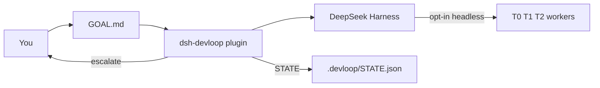
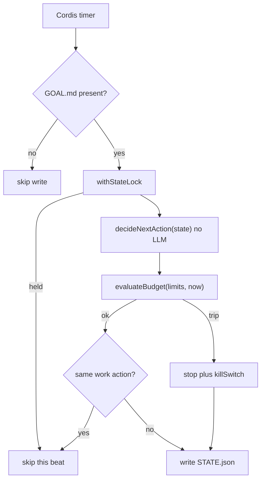
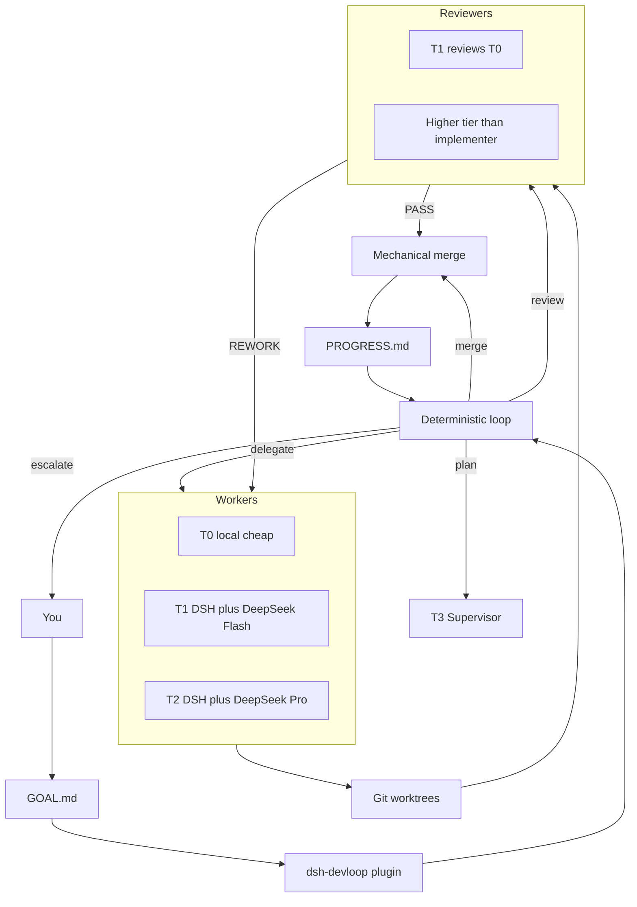

# DevLoop

DeepSeek Harness plugin: **expensive models plan and review, cheap models implement, a program loop keeps the factory inside budget.**

This repository is `dsh-devloop`. It is not another coding agent and it does not fork DSH core. Design and decisions: [docs/](https://github.com/jhfnetboy/DevLoop/tree/main/docs).

## What 0.2.5 does

- Installs into a DSH profile as a bundle plugin
- On each tick, if the workspace has `.devloop/GOAL.md`, reads `STATE.json` and records the next loop action (plan / delegate / review / merge / stop)
- Enforces budget / circuit-breaker rules in-process
- Does **not** spawn workers by default (`agentBackend: noop`). Opt-in: `dsh` (`dsh --profile headless`), `claude` (`claude -p`), `codex` (`codex exec`).
- After writing STATE, plan / delegate / review is handed to `AgentBackend.run` (NoopBackend in production, outside the lock)
- `delegate` creates `.devloop/worktrees/<taskId>` and writes `.devloop/CONTRACT.json` inside it
- Set `agentBackend: dsh` / `claude` / `codex` to spawn that CLI in the worktree (or workspace)
- `merge` is mechanical git: `merge_ready` plus Review `PASS` / `PASS_WITH_NOTES` merges `devloop/<taskId>` into workspace HEAD, deletes the worktree, marks the task `done`. No PASS → escalate. Does not push. Does not call AgentBackend.

Install: [`docs/Install.md`](./docs/Install.md). This cut: [`docs/Release.md`](./docs/Release.md).

## Product target (not all shipped)

The expensive-vs-cheap split is from [`docs/Solution.md`](./docs/Solution.md). The T3 CLI split matches [`docs/CONTEXT.md`](./docs/CONTEXT.md) and ADR-0005: Codex leans Supervisor / scheduling; Claude leans architecture and key review. Image / video models (Qwen image, Wan, etc.) are **out of this loop**.

| Role | Who | Job | When |
|---|---|---|---|
| T3 Supervisor / plan / challenge review | Codex CLI (`codex exec`) | `/plan`, scheduling, adversarial and planning-doc review, PR review | **0.2.5** (opt-in `agentBackend: codex`; **one `agentBackend` per host**) |
| T3 architecture / key review / acceptance | Claude Code CLI (`claude -p`) | Architecture, design, key review, acceptance | **0.2.5** (opt-in `agentBackend: claude`; **one `agentBackend` per host**) |
| T1 / T2 implement | DSH + DeepSeek Flash / V4 Pro | Diffs, tools, bounded code changes **from** the T3 plan | spawn exists in 0.2.3; **no** `contract.tier` routing yet |
| Optional T2 stand-ins | GLM / Kimi / other APIs already in DSH | Same worker tier, not a new runtime | config later |
| Outer loop | This plugin | 24h tick, budget, self-iteration — not one unbounded chat | **0.3** |

`Config` has a routing table (including a T3 `codex` default) but **dispatch does not read it** yet.

**Secondary development:** DSH tree-outside plugin (do not fork Harness). Ideas from community `dsh-devflow`; this repo is a rebuild, not a copy.

## Progress vs that target

**0.2.4 is this slice.** Mechanical merge lands after Review PASS. Claude/Codex CLI and the 24h unattended loop are still ahead.

| Slice | Status | Meaning |
|---|---|---|
| 0.1.x | **Done** (on `main`) | Installable plugin, deterministic loop, budget, `.devloop/STATE.json` |
| 0.2.1 | **Done** | `AgentBackend` after lock; production default `noop` |
| 0.2.2 | **Done** | Worktree + frozen Task Contract |
| 0.2.3 | **Done** (tag `v0.2.3`) | Opt-in `dsh --profile headless`; same command for plan/delegate/review; no tier split |
| **0.2.4** | **This slice** | Mechanical merge only after Review PASS; then delete worktree |
| **0.2.5** | **Not started** | Spawn `claude` / `codex` as T3; DSH Flash/Pro remain T1/T2 |
| **0.3** | **Not started** | Unattended 24h loop, auto-pump, PROGRESS.md |
| **0.4** | **Not started** | Operator UI / human queue / budget panel — **not** required for the autonomous loop |

Path to the goal you described:

```text
v0.2.3
  → 0.2.4 mechanical merge          # this slice: land code, delete worktree
  → 0.2.5 Claude + Codex T3 CLIs    # plan/review vs implement split
  → 0.3 unattended loop             # 24h self-iteration under budget
```

Each slice is its own stacked PR onto the latest `main`. Merge 0.2.4 when it is approved, then start 0.2.5 from that `main`, then 0.3. Do not skip 0.2.4/0.2.5 and jump to 0.3. **0.4 is a later operator surface**, after the loop can already run.

## How it fits



Harness is the agent runtime. This plugin is the engineering scheduler. Default `noop` only writes the next action. Opt-in `dsh` / `claude` / `codex` spawn one-shot CLIs. Merge is mechanical git after Review PASS.

## Tick (what ships now)



`decideNextAction` only sees state. Cost / timeout / attempt caps are applied afterwards in `runTick`, so a budget trip can rewrite any intended action into `stop`.

## Target factory (0.2 and later)



Until 0.2.5, plan / delegate / review still share the same headless command. Merge lands git locally and does not push.

## Can 0.2.4 meet the product goal?

The goal is: expensive models plan and review, cheap models implement, a program loop keeps the factory inside budget.

| Goal slice | 0.2.4 |
|---|---|
| DSH plugin, not a new runtime | Yes. Bundle + Cordis Service. |
| Program loop, one transition per tick | Yes. Pure `decideNextAction` plus `runTick`. |
| Hard budget / kill switch | Yes, in-process. No live token/cost feed yet. |
| File-backed recoverability | Partial. `GOAL.md` + `STATE.json` + `LOCK` + worktree `CONTRACT.json`. No PLAN / PROGRESS yet. |
| Cheap workers actually implement | Partial. Opt-in `dsh` / `claude` / `codex` spawn that CLI; it does not pick a worker via `contract.tier`. Merge lands local git after Review PASS; it does not push. |
| Expensive models actually review | Partial. Plan / delegate / review all use that same headless command; there is no higher-tier reviewer routing. PASS / REWORK is still operator-driven (or a later T3 CLI). |
| Unattended milestone completion | **No.** 0.3. |

0.2.4 can turn a Review PASS into merged code on the local branch. It cannot spawn Claude/Codex (**0.2.5**), and cannot run unattended 24h (**0.3**).

## Requirements

- Node `^22.19.0 || >=24.0.0` (DSH engines; Node 23 is not in the Harness range)
- pnpm
- DeepSeek Harness CLI (`npm i -g @deepseek-ai/dsh` or `pnpm dsh` from a harness checkout)
- A working `dsh web` (or any profile you want the plugin in)

## Build

```bash
pnpm install
pnpm test
pnpm build
```

Git installs run `prepare` → `pnpm build`, so the published entry is `lib/`.

## Install into DSH

Pinned GitHub tag (needs git tag `v0.2.3`; until then `github:jhfnetboy/DevLoop`). Git install runs `prepare` → `pnpm build`. pnpm ≥10 may ignore that build and still exit 0 — if it prints `Ignored build scripts`, approve `dsh-devloop` (`onlyBuiltDependencies` on pnpm 10.1–10.25, `allowBuilds` on ≥10.26, or `pnpm approve-builds`) and re-run `add` (not `pnpm rebuild`), even when `add` succeeded:

Quote the spec: zsh treats `#` as a glob (`no matches found`).

```bash
dsh plugin --profile web add 'github:jhfnetboy/DevLoop#v0.2.3'
```

From this checkout (after `pnpm build`):

```bash
dsh plugin --profile web add /absolute/path/to/DevLoop
```

Full operator steps: [`docs/Install.md`](./docs/Install.md).

Restart the profile:

```bash
dsh web
```

Confirm the layer is composed:

```bash
dsh --profile web --dump-config | grep -A2 devloop
```

You should see a `# == dsh-devloop` layer and an inserted row `id: devloop`.

Optional overrides in `~/.dsh/profiles/web/cordis.patch.yml`:

```yaml
- id: devloop
  config:
    root: /path/to/your/project
    tickIntervalMs: 2000
    agentBackend: dsh
    # agentBackend: claude   # claude -p
    # agentBackend: codex    # codex exec
    budget:
      maxCostUsdPerDay: 20
      taskTimeoutMinutes: 45
      taskLifetimeMinutes: 135
```

`agentBackend` defaults to `noop` (no spawn). Set `dsh`, `claude`, or `codex` only when that CLI is on PATH.

## Arm a project

The plugin is idle until the target workspace contains `.devloop/GOAL.md` (a regular file). A bare `.devloop/` directory does not arm it.

```bash
mkdir -p /path/to/your/project/.devloop
# after plugin install:
cp ~/.dsh/profiles/web/node_modules/dsh-devloop/templates/GOAL.md \
  /path/to/your/project/.devloop/GOAL.md
# from a local checkout, use templates/GOAL.md instead
# edit GOAL.md, then start dsh from that project (or set config.root)
```

Each tick writes `.devloop/STATE.json` with `lastAction`. With `agentBackend: noop` (default) it still does not edit your source tree. `dsh` / `claude` / `codex` run that CLI in the worktree.

## Uninstall

```bash
dsh plugin --profile web remove dsh-devloop
```

## Reference implementations (not vendored)

Local clones used while writing 0.1 (outside this repo):

- `deepseek-ai/deepseek-harness` — plugin / bundle API
- `H97y/dsh-devflow` — winner reference for tick + worktree + pipeline ideas

We rebuild; we do not copy that product’s requirement-pool model.

## License

Apache-2.0. DSH and `dsh-devflow` are MIT; we depend on their public plugin API only.
