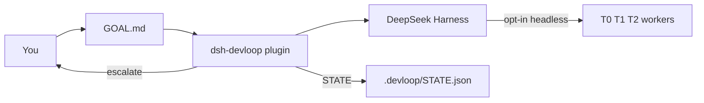
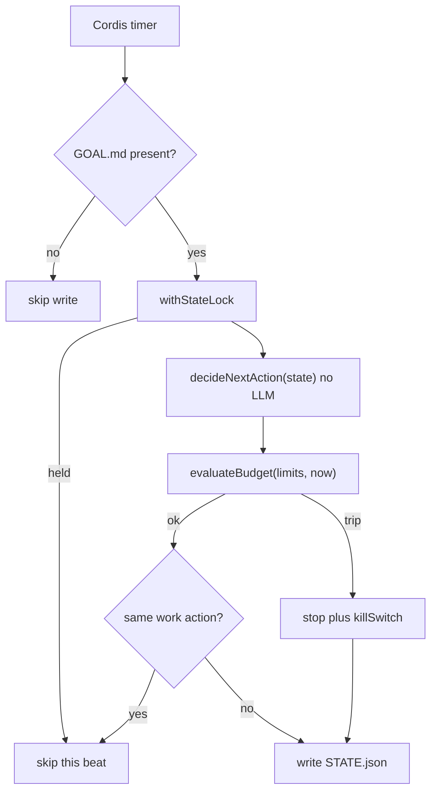
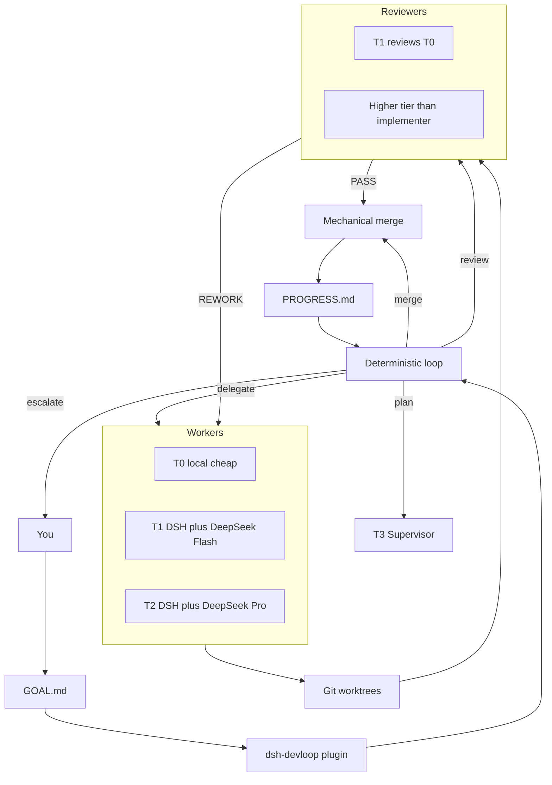

# DevLoop

DeepSeek Harness plugin: **expensive models plan and review, cheap models implement, a program loop keeps the factory inside budget.**

This repository is `dsh-devloop`. It is not another coding agent and it does not fork DSH core. Design and decisions: [docs/](https://github.com/jhfnetboy/DevLoop/tree/main/docs).

## What 0.3.0 does

- Advances the bounded plan → delegate → review → local merge pipeline from validated, versioned model results
- Adds a human snapshot at `.devloop/PROGRESS.md` after each tick (including latched idle, killSwitch, and unreadable STATE)
- Each dispatch is a new one-shot CLI; at most one in flight (`busy`). The next tick waits.
- `tokens` / `costUsd` from the backend fold into budget usage when present; session cost resets when the plugin starts; daily cost resets at UTC midnight
- What each CLI can actually report, measured against the installed versions:
  `claude -p --output-format json` gives token counts **and** a settled
  `total_cost_usd`; `codex exec --json` gives token counts and **no price**, so
  none is invented for it; `dsh --profile headless` has no output options at
  all and reports **neither**. That last one matters: the implementers are
  where most of the spend is, so `maxCostUsdPerDay` currently only sees what
  the planner and reviewer cost
- Still no operator UI (**0.4**)
- Installs into a DSH profile as a bundle plugin
- On each tick, if the workspace has `.devloop/GOAL.md`, reads revisioned state and deterministically chooses plan / delegate / review / merge / stop
- Enforces budget / circuit-breaker rules in-process
- Does **not** spawn workers by default (`agentBackend: noop`). Opt in to one fixed CLI, or use `agentBackend: routed` for role/tier routing.
- After writing STATE, plan / delegate / review is handed to `AgentBackend.run` outside the lock; validated results are committed in a second revision-checked transition
- `delegate` creates `.devloop/worktrees/<taskId>` and writes `.devloop/CONTRACT.json` inside it
- With `agentBackend: routed`, plan uses `plannerRoute`, delegate uses `routing[contract.tier]`, and review uses the independent `reviewerRoute`
- `reviewerRoute` may name the `forge` backend to review on a GitHub pull request instead of a local CLI
- `merge` is mechanical git: `merge_ready` plus Review `PASS` / `PASS_WITH_NOTES` merges `devloop/<taskId>` into workspace HEAD, deletes the worktree, marks the task `done`. No PASS → escalate. Does not push. Does not call AgentBackend.

Install: [`docs/Install.md`](./docs/Install.md). This cut: [`docs/Release.md`](./docs/Release.md).
Multi-model architecture choices and the recommended Harness-native path: [`docs/OrchestrationOptions.md`](./docs/OrchestrationOptions.md).

## Product target (not all shipped)

The expensive-vs-cheap split is from [`docs/Solution.md`](./docs/Solution.md). The T3 CLI split matches [`docs/CONTEXT.md`](./docs/CONTEXT.md) and ADR-0005: Codex leans Supervisor / scheduling; Claude leans architecture and key review. Image / video models (Qwen image, Wan, etc.) are **out of this loop**.

| Role | Who | Job | When |
|---|---|---|---|
| T3 Supervisor / plan | Codex CLI (`codex exec`) | `/plan`, scheduling, adversarial planning | **0.3** (`plannerRoute`) |
| T3 architecture / key review / acceptance | Claude Code CLI (`claude -p`) | Architecture, key review, acceptance | **0.3** (`reviewerRoute`) |
| T1 / T2 implement | DSH + DeepSeek Flash / V4 Pro | Diffs, tools, bounded code changes **from** the T3 plan | **0.3** (`routing[contract.tier]`) |
| Optional T2 stand-ins | GLM / Kimi / other APIs already in DSH | Same worker tier, not a new runtime | config later |
| Outer loop | This plugin | 24h tick, budget, self-iteration — not one unbounded chat | **0.3** |

Routing is opt-in. The safe default remains `noop`; fixed `dsh` / `claude` / `codex` modes remain for compatibility.

**Secondary development:** DSH tree-outside plugin (do not fork Harness). Ideas from community `dsh-devflow`; this repo is a rebuild, not a copy.

## Progress vs that target

**0.3 is the current release candidate.** It combines the unattended scheduler,
role-aware one-shot dispatch, host-enforced task boundaries, SHA-bound review,
durable recovery, and human-readable progress snapshots.

| Slice | Status | Meaning |
|---|---|---|
| 0.1.x | **Done** (on `main`) | Installable plugin, deterministic loop, budget, `.devloop/STATE.json` |
| 0.2.1 | **Done** | `AgentBackend` after lock; production default `noop` |
| 0.2.2 | **Done** | Worktree + frozen Task Contract |
| 0.2.3 | **Done** (tag `v0.2.3`) | Opt-in `dsh --profile headless`; same command for plan/delegate/review; no tier split |
| **0.2.4** | **Done** (PR #11 on `main`) | Mechanical merge only after Review PASS; then delete worktree |
| **0.2.5** | **Done** (PR #12 on `main`) | Spawn `claude` / `codex` as T3; DSH Flash/Pro remain T1/T2 |
| **0.2.6** | **Done** (on `main`) | Host commit, Claude `--`, Codex gitdir |
| **0.3** | **This slice** | Continuous scheduler ticks, role/tier routing, one-shot dispatch, budget signals, PROGRESS.md |
| **0.4** | **Not started** | Operator UI / human queue / budget panel — **not** required for the autonomous loop |

Path to the goal you described:

```text
v0.2.3
  → 0.2.4 mechanical merge          # on main (PR #11)
  → 0.2.5 Claude + Codex T3 CLIs    # on main (PR #12)
  → 0.2.6 T3 harden                 # host commit
  → 0.3 unattended scheduler        # this slice: continuous bounded ticks
```

The prerequisite slices are on `main`. **0.4 is a later operator surface**,
after the bounded autonomous loop is released and observed in real projects.

## How it fits



Harness is the agent runtime. This plugin is the engineering scheduler. Default `noop` only writes the next action. Opt-in `dsh` / `claude` / `codex` spawn one-shot CLIs. Merge is mechanical git after Review PASS.

## Tick (what ships now)



`decideNextAction` only sees state. Cost / timeout / attempt caps are applied afterwards in `runTick`, so a budget trip can rewrite any intended action into `stop`.

## Target factory (0.2 and later)



In routed mode, plan / delegate / review use independent configured routes. Merge lands git locally and does not push.

## Can 0.3 meet the product goal?

The goal is: expensive models plan and review, cheap models implement, a program loop keeps the factory inside budget.

| Goal slice | 0.3.0 |
|---|---|
| DSH plugin, not a new runtime | Yes. Bundle + Cordis Service. |
| Program loop, one transition per tick | Yes. Pure `decideNextAction` plus `runTick`, driven by `setInterval`. |
| Hard budget / kill switch | Yes, in-process. Live token/cost only if the backend fills `AgentRunResult`. |
| File-backed recoverability | `GOAL.md` + revisioned `STATE.json` + append-only `EVENTS.jsonl` + `LOCK` + `PROGRESS.md` + worktree `CONTRACT.json`. |
| Cheap workers actually implement | Yes when opted in. Routed mode selects `routing[contract.tier]`; the host validates changed paths and creates the commit. |
| Expensive models actually review | Yes when opted in. Review is bound to the implementation SHA and an independent provider/model identity. |
| Unattended milestone completion | Yes for the bounded plan → delegate → review → local merge chain; push and release remain explicit operator actions. |

0.3 advances the bounded pipeline from validated machine results under budget. The operator UI, general API broker, and pstack-style multi-candidate arena remain 0.4.

## Requirements

- Node `^22.19.0 || >=24.0.0` (DSH engines; Node 23 is not in the Harness range)
- pnpm
- DeepSeek Harness CLI (`npm i -g @deepseek-ai/dsh` or `pnpm dsh` from a harness checkout)
- A working `dsh web` (or any profile you want the plugin in)

## Build

```bash
pnpm install
pnpm test
pnpm build
```

Git installs run `prepare` → `pnpm build`, so the published entry is `lib/`.

## Install into DSH

Pinned GitHub tag (needs git tag `v0.3.0`; until then `github:jhfnetboy/DevLoop`). Git install runs `prepare` → `pnpm build`. pnpm ≥10 may ignore that build and still exit 0 — if it prints `Ignored build scripts`, approve `dsh-devloop` (`onlyBuiltDependencies` on pnpm 10.1–10.25, `allowBuilds` on ≥10.26, or `pnpm approve-builds`) and re-run `add` (not `pnpm rebuild`), even when `add` succeeded:

Quote the spec: zsh treats `#` as a glob (`no matches found`).

```bash
dsh plugin --profile web add 'github:jhfnetboy/DevLoop#v0.3.0'
```

From this checkout (after `pnpm build`):

```bash
dsh plugin --profile web add /absolute/path/to/DevLoop
```

Full operator steps: [`docs/Install.md`](./docs/Install.md).

Restart the profile:

```bash
dsh web
```

Confirm the layer is composed:

```bash
dsh --profile web --dump-config | grep -A2 devloop
```

You should see a `# == dsh-devloop` layer and an inserted row `id: devloop`.

Optional overrides in `~/.dsh/profiles/web/cordis.patch.yml`:

```yaml
- id: devloop
  config:
    root: /path/to/your/project
    tickIntervalMs: 2000
    agentBackend: routed
    plannerRoute: { tier: T3, backend: codex, model: gpt-5.4 }
    reviewerRoute: { tier: T3, backend: claude, model: opus }
    budget:
      maxCostUsdPerDay: 20
      taskTimeoutMinutes: 45
      taskLifetimeMinutes: 135
```

`agentBackend` defaults to `noop` (no spawn). Routed defaults require `dsh`, `claude`, and `codex` on PATH; override routes to match the installed adapters.

### Review on a pull request instead of a local reviewer

Point `reviewerRoute` at the `forge` backend to move review off this machine. The
reviewed commit is pushed, a pull request is opened (or reused), and the verdict
is read back from a PR comment. Requires `gh` on PATH, authenticated, and a
remote that accepts the push.

```yaml
- id: devloop
  config:
    agentBackend: routed
    reviewerRoute: { tier: T3, backend: forge, model: pull-request }
    forge:
      pushUrl: git@github.com:acme/widgets.git
      base: main
      reviewers: [some-login, some-review-bot]
      pollIntervalMs: 30000
```

`forge.pushUrl` and `forge.reviewers` have no defaults and are both **required**:
without them the route refuses to review rather than guessing a target or
accepting whoever comments first. Needs git ≥ 2.7.

The reviewer answers in a comment carrying the same envelope the CLI reviewers
emit, bound to the exact commit under review:

```text
<devloop_result>{"version":1,"kind":"review","taskId":"TASK-001",
"reviewedSha":"<the SHA named in the PR body>","verdict":"PASS","notes":"..."}</devloop_result>
```

What this path establishes before a verdict counts — re-checked on every poll,
not just when the pull request is opened:

- The target is `forge.pushUrl` from DevLoop configuration. The workspace's own
  remotes are **never** consulted: `git remote get-url` applies the checkout's
  `url.*.pushInsteadOf`, so a poisoned repository could hand back an
  already-retargeted URL that every later check would agree with. That host is
  also the identity namespace `reviewers` is read in, so it must not be
  selectable by the checkout. `GH_REPO` and `GH_HOST` are cleared and every `gh`
  call is pinned to `HOST/OWNER/REPO`.
- Every child gets an **allowlisted** environment, not a filtered one. Only what
  is needed to reach the forge as you survives: `PATH` and the Windows equivalents,
  `HOME`/`USERPROFILE`, `SSH_AUTH_SOCK`, `GH_TOKEN` and friends, the standard
  proxy variables, and locale/temp. Everything else is dropped, including names
  invented after this code was written. A denylist was tried first and lost twice
  — to `GIT_CONFIG_PARAMETERS`, then to `XDG_CONFIG_HOME`.
  One consequence worth knowing: git global config is read through `HOME`, so a
  credential helper in `~/.gitconfig` works, but one kept only under
  `$XDG_CONFIG_HOME/git/config` will not be seen.
- The push runs from a **throwaway repository** that borrows the workspace's
  object store but none of its configuration. The workspace `.git/config` is
  exactly the file models have been editing, and git will run commands it names
  during a push through more settings than can be listed — `credential.helper`,
  `core.sshCommand`, `remote.<name>.vcs`, a signer via `push.gpgSign`, nested
  pushes via `push.recurseSubmodules`, transport redirection via `http.*`, or a
  remote whose *name* is the literal target URL. Excluding that file is the only
  defense that does not depend on keeping a list current. Your **global** config
  still applies, so your own credential helper keeps working. The scratch repo
  names the target remote itself and both validates and pushes through that
  name, so the URL is never re-resolved as a remote name.
- The commit is pushed **by SHA** (`<sha>:refs/heads/devloop/<task>`), never with
  `--force`, so the branch cannot move between the read and the push.
- The pull request must be same-repository and must still have that exact commit
  as its head, on the expected base and head branch. Two open pull requests for
  one head is an error, not a guess.
- The author must be on `forge.reviewers` and must not be the account this host
  authenticates as, so the loop cannot merge on its own signature.
- The whole comment thread is read with pagination. A thread is never truncated
  to a window — that would let filler bury an objection behind a later approval —
  and one longer than 2000 comments is refused instead.
- The verdict must echo the task id and the implementation SHA, so an approval
  left on a reused pull request from an earlier attempt is ignored. A pull
  request reused for a second attempt is rewritten to name the new commit, so
  the instructions never point at a commit whose verdict would be discarded.
- **Any** non-approving verdict for that commit outranks an approval, whoever
  commented last.
- Git runs with repository hooks disabled and terminal prompts off, so a poisoned
  checkout cannot execute a `pre-push` hook on this host.

One dispatch waits for the verdict; `runTick` latches a repeated review, so
polling from the outer loop would ask the forge exactly once. The wait is bounded
by `forge.maxWaitMs`, or by the task's own `taskTimeoutMinutes` when that is `0`.
That deadline starts before the push, not after it, and caps every git and `gh`
call. It reserves a grace for reaping a child that overruns, but that reaping and
the scratch cleanup happen after the timer, so treat the bound as close-to rather
than exactly wall-clock; the loop's own dispatch abort is the hard stop. A wait that ends
with no verdict escalates instead of merging. The loop runs one dispatch at a
time, so an unreviewed pull request holds the loop for that budget — size
`taskTimeoutMinutes` to the review latency you actually expect.

Known limits:

- An approval withdrawn or edited *after* the verdict is recorded is not re-read
  before the merge tick. Treat a recorded verdict as an attestation about that
  commit, not as live pull-request state.
- GitHub review submissions (Approve / Request changes) are **not** consumed;
  only issue comments on the pull request are.
- `STATE.json` records the route (`forge/pull-request`) rather than which
  allowlisted login approved — `RoutedBackend` deliberately overwrites an
  adapter's self-reported identity. The pull request itself is the audit trail
  for who decided; the adapter is what enforces that they were authorized.

`merge` is unchanged: still a local git merge that does not push, so the pull
request stays open for you to close.

## Arm a project

The plugin is idle until the target workspace contains `.devloop/GOAL.md` (a regular file). A bare `.devloop/` directory does not arm it.

```bash
mkdir -p /path/to/your/project/.devloop
# after plugin install:
cp ~/.dsh/profiles/web/node_modules/dsh-devloop/templates/GOAL.md \
  /path/to/your/project/.devloop/GOAL.md
# from a local checkout, use templates/GOAL.md instead
# edit GOAL.md, then start dsh from that project (or set config.root)
```

Each tick writes `.devloop/STATE.json`, appends `.devloop/EVENTS.jsonl`, and updates `PROGRESS.md`. With `agentBackend: noop` (default) it does not edit source. `dsh` / `claude` / `codex` run that CLI in the worktree; `subagent:<provider>` reuses an installed Harness provider.

## Uninstall

```bash
dsh plugin --profile web remove dsh-devloop
```

## Reference implementations (not vendored)

Local clones used while writing 0.1 (outside this repo):

- `deepseek-ai/deepseek-harness` — plugin / bundle API
- `H97y/dsh-devflow` — winner reference for tick + worktree + pipeline ideas

We rebuild; we do not copy that product’s requirement-pool model.

## License

Apache-2.0. DSH and `dsh-devflow` are MIT; we depend on their public plugin API only.
