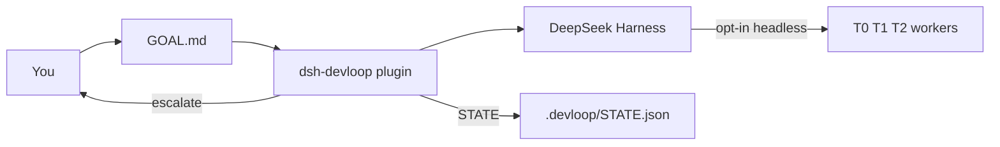
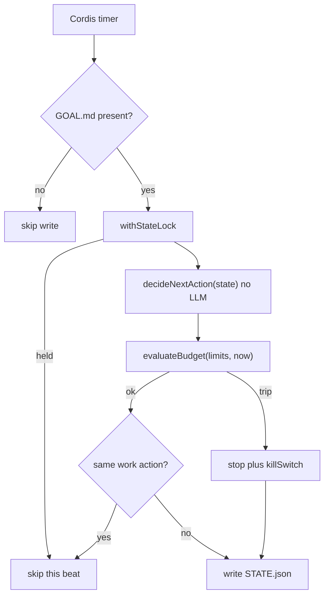
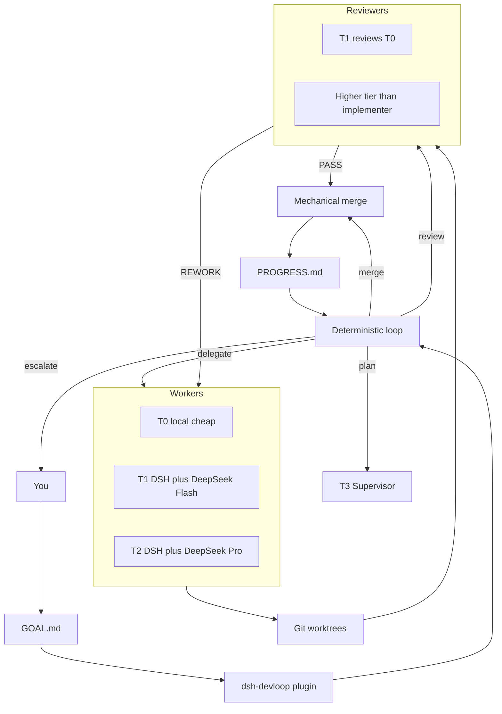

# DevLoop

DeepSeek Harness plugin: **expensive models plan and review, cheap models implement, a program loop keeps the factory inside budget.**

This repository publishes `@jhfnetboy/dsh-devloop`. It is not another coding agent and it does not fork DSH core. Design and decisions: [docs/](https://github.com/jhfnetboy/DevLoop/tree/main/docs).

## Quick start

Five commands to a loop that ticks. The default backend (`noop`) calls no model
and writes nothing but `.devloop/`, so this is safe against a real project: you
get the loop, its state and its questions, and nothing touches your source until
you set `agentBackend` yourself.

```bash
# 1. Build (Node ^22.19 || >=24, pnpm, and a working `dsh` — see Requirements)
pnpm install && pnpm build

# 2. Add the plugin to a DSH profile
dsh plugin --profile web add /absolute/path/to/DevLoop

# 3. Arm the project you want worked on — the loop stays idle without GOAL.md
mkdir -p /path/to/project/.devloop
cp templates/GOAL.md /path/to/project/.devloop/GOAL.md
$EDITOR /path/to/project/.devloop/GOAL.md

# 4. Start the profile from that project
cd /path/to/project && dsh web

# 5. Ask what the loop is doing
node lib/bin/devloop.js status /path/to/project
```

`devloop status` is the one command worth remembering. It exits non-zero when
the loop is stopped **or** would stop on its next tick, and when it is waiting on
a person it prints the question and the exact commands that answer it:

```
revision 3 (default budgets)
halted:
  killSwitch is set
  last action was stop:budget
  supervisor hold: empty_task
resuming would let the loop continue

The task branch has no commits, but review passed it. Did it need any change?
  - task t1 is still at the commit it started from
  - a review verdict of PASS is recorded against it
  node <plugin>/lib/bin/devloop.js answer retry  /path/to/project   run the worker on the task again, in its existing worktree
  node <plugin>/lib/bin/devloop.js answer accept /path/to/project   agree the task needed no change and mark it done
  node <plugin>/lib/bin/devloop.js answer stop   /path/to/project   leave the loop halted; nothing changes
```

Those `answer` lines are printed by the loop itself, and each one can be pasted
as it stands: `<plugin>` is printed as the absolute path of the copy you ran,
and the project root is filled in. It is spelled as a path because nothing puts
`devloop` on `PATH` — npm and pnpm do not link a package's own `bin` into its
own `node_modules/.bin`, and `dsh plugin add` does not either. From this
checkout the path is `lib/bin/devloop.js`; against a profile that already has
the plugin, it is that profile's copy:

```bash
node ~/.dsh/profiles/web/node_modules/@jhfnetboy/dsh-devloop/lib/bin/devloop.js status /path/to/project
```

Worth an alias if you use it often.

Then, in order: [Install into DSH](#install-into-dsh) for the pinned-tag install
and the pnpm build-script caveat, [Arm a project](#arm-a-project) for what each
tick writes, [Acceptance checks](#acceptance-checks) to stop trusting a worker's
own claim of success, [Unsticking a halted loop](#unsticking-a-halted-loop)
when an answer is not enough, and [Dashboard](#dashboard) to do all of it from a
browser, including from another device.

Everything above this line is how to run it. Everything below is why it is built
this way.

## What 0.6.6 does

- Advances the bounded plan → delegate → review → local merge pipeline from validated, versioned model results
- Adds a human snapshot at `.devloop/PROGRESS.md` after each tick (including latched idle, killSwitch, and unreadable STATE)
- Each dispatch is a new one-shot CLI; at most one in flight (`busy`). The next tick waits.
- `tokens` / `costUsd` from the backend fold into budget usage when present; session cost resets when the plugin starts; daily cost resets at UTC midnight
- What each CLI can actually report, measured against the installed versions:
  `claude -p --output-format json` gives token counts **and** a settled
  `total_cost_usd`; `codex exec --json` gives token counts and **no price**, so
  none is invented for it; `dsh --profile headless` has no output options at
  all and reports **neither**. That last one matters: the implementers are
  where most of the spend is, so `maxCostUsdPerDay` currently only sees what
  the planner and reviewer cost
- A dashboard at `/devloop/` in the web profile, reachable from any device on a tailnet: every project's loop, its tasks and pending question, answer / resume / pause, and registering and starting projects — one loop per project under a shared daily cap ([Dashboard](#dashboard))
- A halted loop waits rather than disposing its timer, so an answer or a resume from any surface is picked up on the next tick with no profile restart; `devloop pause` stops a healthy one
- Installs into a DSH profile as a bundle plugin
- On each tick, if the workspace has `.devloop/GOAL.md`, reads revisioned state and deterministically chooses plan / delegate / review / merge / stop
- Enforces budget / circuit-breaker rules in-process
- Does **not** spawn workers by default (`agentBackend: noop`). Opt in to one fixed CLI, or use `agentBackend: routed` for role/tier routing.
- After writing STATE, plan / delegate / review is handed to `AgentBackend.run` outside the lock; validated results are committed in a second revision-checked transition
- `delegate` creates `.devloop/worktrees/<taskId>` and writes `.devloop/CONTRACT.json` inside it
- With `agentBackend: routed`, plan uses `plannerRoute`, delegate uses `routing[contract.tier]`, and review uses the independent `reviewerRoute`
- `reviewerRoute` may name the `forge` backend: one GitHub pull request per task into the work branch, reviewed there and merged by DevLoop, then one release pull request to trunk
- `merge` is mechanical git: `merge_ready` plus Review `PASS` / `PASS_WITH_NOTES` merges `devloop/<taskId>` into workspace HEAD, deletes the worktree, marks the task `done`. No PASS → escalate. In local mode it does not push; with the `forge` review route the merge happens on GitHub and the checkout fast-forwards to it. Does not call AgentBackend.

Install: [`docs/Install.md`](./docs/Install.md). This cut: [`docs/Release.md`](./docs/Release.md).
Multi-model architecture choices and the recommended Harness-native path: [`docs/OrchestrationOptions.md`](./docs/OrchestrationOptions.md).

## Product target (not all shipped)

The expensive-vs-cheap split is from [`docs/Solution.md`](./docs/Solution.md). The T3 CLI split matches [`docs/CONTEXT.md`](./docs/CONTEXT.md) and ADR-0005: Codex leans Supervisor / scheduling; Claude leans architecture and key review. Image / video models (Qwen image, Wan, etc.) are **out of this loop**.

| Role | Who | Job | When |
|---|---|---|---|
| T3 Supervisor / plan | Codex CLI (`codex exec`) | `/plan`, scheduling, adversarial planning | **0.3** (`plannerRoute`) |
| T3 architecture / key review / acceptance | Claude Code CLI (`claude -p`) | Architecture, key review, acceptance | **0.3** (`reviewerRoute`) |
| T1 / T2 implement | DSH + DeepSeek Flash / V4 Pro | Diffs, tools, bounded code changes **from** the T3 plan | **0.3** (`routing[contract.tier]`) |
| Optional T2 stand-ins | GLM / Kimi / other APIs already in DSH | Same worker tier, not a new runtime | config later |
| Outer loop | This plugin | 24h tick, budget, self-iteration — not one unbounded chat | **0.3** |

Routing is opt-in. The safe default remains `noop`; fixed `dsh` / `claude` / `codex` modes remain for compatibility.

**Secondary development:** DSH tree-outside plugin (do not fork Harness). Ideas from community `dsh-devflow`; this repo is a rebuild, not a copy.

## Progress vs that target

**0.6.6 is the current release.** One repository is worked on goal after goal: a finished goal is archived and the next is started from its page; with the `forge` review route each project pushes to the repository confirmed for it, and a commit that fails a mechanical check goes back to the worker before any pull request opens. 0.6.5 hardened 0.6.4's per-task pull requests: models run without the host's git and GitHub credentials, checks can be required, and a forge refusal is its own question. 0.6.4 made each task, with the `forge` review route, a GitHub pull request reviewed there and merged by DevLoop, then one release pull request to trunk. 0.6.3 made the page speak English, Chinese and Thai (switch at the top right; English by default). 0.6.2 put what needs you first on the home page, and made a halt offer one answer with its cost said. 0.6.1 held each task's change to a per-PR budget, judged by PR-daemon's own pre-PR rules, and logged every check for tuning. 0.6.0 added the operator surface: a dashboard over one loop per project. Before it, 0.3 combined the unattended scheduler,
role-aware one-shot dispatch, host-enforced task boundaries, SHA-bound review,
durable recovery, and human-readable progress snapshots; 0.4 makes a halt
answerable, runs the operator's own checks before a reviewer is paid, and stops
charging for a dispatch no provider ever saw.

| Slice | Status | Meaning |
|---|---|---|
| 0.1.x | **Done** (on `main`) | Installable plugin, deterministic loop, budget, `.devloop/STATE.json` |
| 0.2.1 | **Done** | `AgentBackend` after lock; production default `noop` |
| 0.2.2 | **Done** | Worktree + frozen Task Contract |
| 0.2.3 | **Done** (tag `v0.2.3`) | Opt-in `dsh --profile headless`; same command for plan/delegate/review; no tier split |
| **0.2.4** | **Done** (PR #11 on `main`) | Mechanical merge only after Review PASS; then delete worktree |
| **0.2.5** | **Done** (PR #12 on `main`) | Spawn `claude` / `codex` as T3; DSH Flash/Pro remain T1/T2 |
| **0.2.6** | **Done** (on `main`) | Host commit, Claude `--`, Codex gitdir |
| **0.3** | **Done** (tag `v0.3.0`) | Continuous scheduler ticks, role/tier routing, one-shot dispatch, budget signals, PROGRESS.md |
| **0.4** | **Done** (tag `v0.4.2`) | Gates, host-run acceptance, quota charged for work that happened |
| **0.5** | **This slice** | Operator dashboard over the tailnet; answer / resume / pause from a browser; one loop per project under a shared daily cap |

Path to the goal you described:

```text
v0.2.3
  → 0.2.4 mechanical merge          # on main (PR #11)
  → 0.2.5 Claude + Codex T3 CLIs    # on main (PR #12)
  → 0.2.6 T3 harden                 # host commit
  → 0.3 unattended scheduler        # this slice: continuous bounded ticks
```

0.5 is the operator surface ([Dashboard](#dashboard)). A general API broker and
the pstack-style multi-candidate arena remain later.

## How it fits



Harness is the agent runtime. This plugin is the engineering scheduler. Default `noop` only writes the next action. Opt-in `dsh` / `claude` / `codex` spawn one-shot CLIs. Merge is mechanical git after Review PASS.

## Tick (what ships now)



`decideNextAction` only sees state. Cost / timeout / attempt caps are applied afterwards in `runTick`, so a budget trip can rewrite any intended action into `stop`.

## Target factory (0.2 and later)



In routed mode, plan / delegate / review use independent configured routes. Merge lands git locally and does not push, unless the review route is `forge` (one pull request per task, merged on GitHub).

## Can 0.3 meet the product goal?

The goal is: expensive models plan and review, cheap models implement, a program loop keeps the factory inside budget.

| Goal slice | 0.6.6 |
|---|---|
| DSH plugin, not a new runtime | Yes. Bundle + Cordis Service. |
| Program loop, one transition per tick | Yes. Pure `decideNextAction` plus `runTick`, driven by `setInterval`. |
| Hard budget / kill switch | Yes, in-process. Live token/cost only if the backend fills `AgentRunResult`. |
| File-backed recoverability | `GOAL.md` + revisioned `STATE.json` + append-only `EVENTS.jsonl` + `LOCK` + `PROGRESS.md` + worktree `CONTRACT.json`. |
| Cheap workers actually implement | Yes when opted in. Routed mode selects `routing[contract.tier]`; the host validates changed paths and creates the commit. |
| Expensive models actually review | Yes when opted in. Review is bound to the implementation SHA and an independent provider/model identity. |
| Unattended milestone completion | Yes for the bounded plan → delegate → review → local merge chain; push and release remain explicit operator actions. |

0.3 advanced the bounded pipeline from validated machine results under budget, and 0.4 makes its halts answerable. 0.5 adds the operator UI; a general API broker and the pstack-style multi-candidate arena remain later.

## Measured against other long-running agent designs

Two published designs describe the same problem from different angles, and
reading them against this code found real gaps rather than confirming what was
already here.

[**LongHorizon-Harness**](https://blog.mushroom.cv/blog/longhorizon-harness-amap-ml-ai-agent-long-task/)
names long-task failure as *cumulative collapse* rather than a single bad step,
with three causes: context pollution, state drift, and a verification gap where
executor and auditor are the same entity, so "claimed done" passes for verified.
Its numbers are worth the attention — same model, same backend, WeaveBench 51.8%
→ 80.7% with 24% fewer tokens — because they say the ceiling was the harness,
not the model. That is the premise this plugin is built on.

[**LoopX**](https://blog.mushroom.cv/blog/loopx-loop-engineering-state-kernel-long-running-agents/)
argues the failure is loss of *control state*: what the objective is, which
decisions are settled, what is waiting on a person, where the last run stopped.
It keeps five durable primitives — Goal, Gates, Todos, Evidence, Quota.

| Their primitive | Here | Status |
|---|---|---|
| Goal | `.devloop/GOAL.md` | present |
| Evidence | `EVENTS.jsonl`, `PROGRESS.md`, revision-checked writes | present |
| Todos | `STATE.json` `tasks[]` | present, but no claim or lease |
| Quota | seven budget circuits | present, and charged at dispatch rather than after a verified result |
| **Gates** | `supervisor: { taskId, reason }` | **an error code, not a question** |

The three causes LongHorizon names are already addressed, and the third more
strictly than it asks: a fresh worktree and a one-shot CLI per task keep history
out; the host owns state and models only propose; and a review is bound to the
exact implementation commit, so a verdict expires the moment the branch moves.

What reading them changed:

- **A halt said what broke, not what to decide.** `reason: "empty_task"` is an
  error code. LoopX's point is that a gate must be *a concrete question with a
  concrete answer*, not a signal that someone is needed. Fixed: see
  [Unsticking a halted loop](#unsticking-a-halted-loop). The loop still stops
  rather than waiting on the gate, which is the remaining half.
- **Acceptance criteria were written, validated, persisted, sent to models — and
  never executed.** `contract.acceptance` reached prompts only. LongHorizon's
  auditor inspects real artifacts; the closest mechanical check here was
  `assertTaskChangesAllowed`, which polices *where* a task wrote, not *whether
  it works*. Fixed: see [Acceptance checks](#acceptance-checks).
- **Quota was charged on dispatch even when nothing ran.** LoopX spends only
  after a validated writeback. Charging strictly that late would let a backend
  that never returns retry for ever, so the narrower rule is used: a dispatch
  refused *before any provider saw it* — a bad route, a missing adapter, a
  precondition the operator has to fix — is refunded. A run that reached a model
  and failed still costs an attempt, because it was one.

  A refund alone was not enough. Handing the attempt back nets the task's count
  to zero every cycle, so `max_task_attempts` — the circuit that names a stuck
  task within seconds — could never fire for exactly the misconfiguration the
  refund exists to forgive, and the loop leaned on a generic no-progress timer
  that halts everything and names nothing. `refusedDispatches` counts refusals
  for the task's lifetime and is never refunded: the attempt stays free, and the
  loop still says which task's route is broken.

Where this design is weaker than either: both assume the executor can report its
own usage. `dsh --profile headless` cannot, so the daily cost cap only sees what
the planner and reviewer spent — a missing instrument, not a decision. Deferred
work is tracked in [`docs/V0.6-TODO.md`](./docs/V0.6-TODO.md).

## Requirements

- Node `^22.19.0 || >=24.0.0` (DSH engines; Node 23 is not in the Harness range)
- pnpm
- DeepSeek Harness CLI (`npm i -g @deepseek-ai/dsh` or `pnpm dsh` from a harness checkout)
- A working `dsh web` (or any profile you want the plugin in)

## Build

```bash
pnpm install
pnpm test
pnpm build
```

Git installs run `prepare` → `pnpm build`, so the published entry is `lib/`.

## Install into DSH

Pinned GitHub tag (needs git tag `v0.6.6`; until then `github:jhfnetboy/DevLoop`). Git install runs `prepare` → `pnpm build`. pnpm ≥10 may ignore that build and still exit 0 — if it prints `Ignored build scripts`, approve `@jhfnetboy/dsh-devloop` (`onlyBuiltDependencies` on pnpm 10.1–10.25, `allowBuilds` on ≥10.26, or `pnpm approve-builds`) and re-run `add` (not `pnpm rebuild`), even when `add` succeeded:

Quote the spec: zsh treats `#` as a glob (`no matches found`).

```bash
dsh plugin --profile web add 'github:jhfnetboy/DevLoop#v0.6.6'
```

From this checkout (after `pnpm build`):

```bash
dsh plugin --profile web add /absolute/path/to/DevLoop
```

Full operator steps: [`docs/Install.md`](./docs/Install.md).

Restart the profile:

```bash
dsh web
```

Confirm the layer is composed:

```bash
dsh --profile web --dump-config | grep -A2 devloop
```

You should see a `# == @jhfnetboy/dsh-devloop` layer and an inserted row `id: devloop`.

Optional overrides in `~/.dsh/profiles/web/cordis.patch.yml`:

```yaml
- id: devloop
  config:
    root: /path/to/your/project
    tickIntervalMs: 2000
    agentBackend: routed
    plannerRoute: { tier: T3, backend: codex, model: gpt-5.4 }
    reviewerRoute: { tier: T3, backend: claude, model: opus }
    budget:
      maxCostUsdPerDay: 20
      taskTimeoutMinutes: 45
      taskLifetimeMinutes: 135
```

`agentBackend` defaults to `noop` (no spawn). Routed defaults require `dsh`, `claude`, and `codex` on PATH; override routes to match the installed adapters.

Everything on DeepSeek, through `dsh --profile headless`. Store the key once in
DSH's credential file (`~/.dsh/.credentials.yaml`, mode 600) rather than in a
config or a launchd plist:

```yaml
version: 1
refs:
  DEEPSEEK_API_KEY: "sk-…"
```

```yaml
- id: devloop
  config:
    agentBackend: routed
    plannerRoute:  { tier: T3, backend: dsh, model: deepseek-v4-pro }
    reviewerRoute: { tier: T3, backend: dsh, model: deepseek-v4-pro }
    routing:
      T0: { tier: T0, backend: dsh, model: deepseek-v4-flash }
      T1: { tier: T1, backend: dsh, model: deepseek-v4-flash }
      T2: { tier: T2, backend: dsh, model: deepseek-v4-flash }
      T3: { tier: T3, backend: dsh, model: deepseek-v4-flash }
```

Every worker tier is Flash on purpose: review refuses a commit whose implementer
has the reviewer's identity, so a worker on `deepseek-v4-pro` could never be
reviewed. `dsh` headless reports no usage, so none of this spend reaches the
cost caps — [Pricing.md](docs/Pricing.md) has the prices for when it can.

### One pull request per task, reviewed and merged on GitHub

Point `reviewerRoute` at the `forge` backend and each task goes through a GitHub
pull request instead of a local merge: the task's commit is pushed, a pull
request opens against the loop's **work branch**, a reviewer decides with a
GitHub review, and DevLoop merges it. When every task is merged, one **release
pull request** takes the work branch to trunk. Requires `gh` on PATH,
authenticated, and a remote that accepts the push. Without the `forge` route
nothing changes: tasks merge locally, as before.

```yaml
- id: devloop
  config:
    agentBackend: routed
    reviewerRoute: { tier: T3, backend: forge, model: pull-request }
    forge:
      pushUrl: git@github.com:acme/widgets.git
      base: main                 # trunk: where the release pull request goes
      reviewers: [some-login]    # whose reviews decide
      localReview: { tier: T3, backend: claude, model: opus }   # optional: review locally first
      pollIntervalMs: 30000
```

`forge.pushUrl` and `forge.reviewers` have no defaults and are both **required**.
`forge.pushUrl` is the profile's own root's repository. Each project added on the
dashboard pushes to its own: before its first start the page shows its checkout's
`origin` (read without `insteadOf` rewriting), the operator confirms or corrects it,
and it is kept in the project registry, never re-read from the checkout. A project
with none confirmed does not start.

How a task goes:

1. **Local review first** (optional, `forge.localReview`). The local reviewer
   runs; only a pass opens a pull request, so the reviewer's rounds are spent on
   changes already worth their time. It may be neither the forge nor a route
   that implements.
2. **The pull request.** The task branch `devloop/<task>` is pushed by SHA, and a
   pull request opens (or is reused) against the **work branch** — the branch the
   loop was started on, recorded in STATE at the first delegate, never trunk.
   The work branch is created on the forge at the task's base if missing,
   fast-forwarded if behind, left alone if ahead (other tasks merged since), and
   refused if it moved away. A checkout that is not on the work branch, or a
   task with none recorded while the checkout is on trunk or detached, holds
   before any pull request is opened. Every pull request is labelled `devloop`.
3. **The verdict** comes from GitHub's own reviews (`forge.verdictSource:
   reviews`, the default): an allowlisted reviewer who is not this host, a review
   of exactly the commit under review, each reviewer's latest word (a dismissed
   review withdraws it). Any **Request changes** outranks every approval and
   becomes rework, its body handed to the worker for the next attempt. An
   approval is a pass only once the commit's **checks are green**; while they run
   the review keeps waiting, and a red one is rework. A commit with no checks at
   all counts as green unless `forge.requireChecks: true`, which makes it wait;
   turn it on for a repository with CI, so an approval given before CI has
   registered its checks cannot merge. It looks only for no checks at all: a
   commit whose checks all came back skipped or neutral has passed, so
   path-filtered workflows keep working. `verdictSource: comments`
   reads a `<devloop_result>` envelope from a comment instead; exactly one
   source is ever read.
4. **The merge.** DevLoop reads the verdict and checks again, then runs `gh pr
   merge --merge --match-head-commit <sha>` as the account it authenticates as,
   from an empty directory, never into trunk. The checkout then fetches that
   merge commit by id and fast-forwards the work branch to it — never a local
   merge — before the task is marked done. A pull request already merged at the
   reviewed commit is not merged again. An approval gone by then holds as
   `no_review_pass`; any other forge error (a branch protection rule, gh's
   login, forge settings) as `forge_merge_refused`, which asks for the fix
   outside DevLoop and a resume, not another worker run; the checkout failing
   to follow the merge as `merge_wedged`.
5. **The release.** Once every task is done, the loop opens the work branch →
   trunk pull request, its body listing each task's head, branch and verdict for
   the reviewer to check the branch against, looks at it each tick, and merges it
   once approved with green checks. The release is always decided by a GitHub
   review, even with `verdictSource: comments`; its body says so. It merges on the forge only; the checkout
   is never moved onto trunk. `STATE.release` records it.

What this path establishes, re-checked every time it acts:

- The target is `forge.pushUrl` from DevLoop configuration, never the
  workspace's own remotes (a checkout's `url.*.pushInsteadOf` could retarget
  them). `GH_REPO` and `GH_HOST` are cleared and every `gh` call is pinned to
  `HOST/OWNER/REPO`.
- Every child gets an **allowlisted** environment: `PATH`, `HOME`,
  `SSH_AUTH_SOCK`, `GH_TOKEN` and friends, proxies, locale and temp. Git global
  config is read through `HOME`, so a credential helper in `~/.gitconfig` works;
  one only under `$XDG_CONFIG_HOME/git/config` is not seen.
- The push runs from a **throwaway repository** that borrows the workspace's
  objects but none of its configuration, by SHA and never with `--force`.
- Git in a task worktree runs with its git directories **pinned** to the host's
  own paths, hooks and fsmonitor off: a worker that rewrites its worktree's
  `.git` pointer or gitdir cannot point the host's git at a repository of its
  own (0.6.4 closed this; see Release.md).
- The pull request must be same-repository, on the expected base and head, with
  the reviewed commit as its head. An open one from the task's branch on
  another base is retargeted, unless one is already on the work branch.

Known limits:

- An empty set of checks counts as green; a repository without CI, or with
  checks that register late, is approved on review alone.
- Worker processes still inherit this host's `gh` login.
- The remote `devloop/<task>` branches are left behind after merging.
- `STATE.json` records the route (`forge/pull-request`) rather than which login
  approved; the pull request is the audit trail for who decided.

## Arm a project

The plugin is idle until the target workspace contains `.devloop/GOAL.md` (a regular file). A bare `.devloop/` directory does not arm it.

```bash
mkdir -p /path/to/your/project/.devloop
# after plugin install:
cp ~/.dsh/profiles/web/node_modules/@jhfnetboy/dsh-devloop/templates/GOAL.md \
  /path/to/your/project/.devloop/GOAL.md
# from a local checkout, use templates/GOAL.md instead
# edit GOAL.md, then start dsh from that project (or set config.root)
```

Each tick writes `.devloop/STATE.json`, appends `.devloop/EVENTS.jsonl`, and updates `PROGRESS.md`. With `agentBackend: noop` (default) it does not edit source. `dsh` / `claude` / `codex` run that CLI in the worktree; `subagent:<provider>` reuses an installed Harness provider.

## Acceptance checks

A worker reporting `outcome: completed` is a claim. `pnpm test` reading the files
it wrote is evidence. Until an operator lists commands, the loop advances on the
claim.

```yaml
- id: devloop
  config:
    acceptance:
      - [pnpm, test]
      - [pnpm, build]
    acceptanceTimeoutMinutes: 15
```

They run in the task's own worktree, after the host commits the work and
**before it is offered for review** — a task that cannot pass them never costs a
reviewer anything. The first failure stops the rest and sends the task back to
the worker, with the command and the end of its output as the next attempt's
instructions; the task's attempts limit, not a question per failure, bounds how
often (`max_task_attempts` asks once they run out).

`acceptanceTimeoutMinutes` is **per command, not for the list**: the two above
are allowed 15 minutes each, so a task can spend 30 before the checks give up.

Given as argv lists, not shell strings: there is no shell, so nothing in a path
or a task title can become another command. The model's own `acceptance` text
stays what it always was — criteria for a human and a reviewer to read. **A model
never chooses what the host executes.**

The trade is stated rather than hidden. Running the project's tests runs code the
worker wrote, so this is off by default; switching it on is the same trust as
typing those commands yourself after reading the diff.

## Pre-PR check

Each task's change can be put through PR-daemon's
mechanical pre-PR rules — the per-PR size budget among them — after the
acceptance checks and before any reviewer is paid.

```yaml
- id: devloop
  config:
    prePrCheck: [bash, ~/Dev/tools/PR-daemon/scripts/pre-pr-check.sh]
    prePrProfile: devloop      # the default
    prePrTimeoutMinutes: 5     # the default
```

DevLoop knows only the checker's contract (argv, exit codes, JSON), never a
rule: the rules live in the PR-daemon repository, so `git -C ~/Dev/tools/PR-daemon
pull --ff-only` changes them for every loop without a DevLoop release.

- **Passed** — reviewed. A change in the elastic band (in the `devloop` profile,
  201–260 lines, 6 files or 3 counted top-level directories) is reviewed with
  its size in front of the reviewer, who judges whether it should have been split.
- **Blocked on size alone** — held as `task_over_budget`; the answer is to redo
  the task smaller from its base.
- **Blocked by another rule** — sent back to the worker with the blocking
  findings (rule, file, line, message) as its next attempt's instructions, so a
  pull request opens only once the mechanical rules pass; bounded by the task's
  attempts limit. Not run on a commit whose acceptance checks already failed.
- **No verdict** (a timeout, a missing checker, output that is not the JSON) —
  held as `prepr_unavailable`, never a pass.

Every check and review verdict is a line in `.devloop/PR-LOG.jsonl` (size,
band, the planner's estimate, rules hit, rules version), shown on the project
page as PR 记录. Off by default: unset, nothing changes.

## Unsticking a halted loop

The loop halts itself on a supervisor hold or a tripped circuit breaker, and it
sets `killSwitch` on the way out. Clearing that flag by hand is usually a false
recovery: whatever tripped is still tripped, so the next tick stops for the same
reason. `devloop` does the whole job.

```bash
# `pnpm exec devloop` does not work: the bin is not linked into this package's
# own node_modules/.bin. Run the file, or alias it. See Quick start.
node lib/bin/devloop.js status ~/dev/myproj    # why it stopped, and whether resuming helps
node lib/bin/devloop.js resume ~/dev/myproj --task AUTH-001
```

`status` exits non-zero while halted, so it drops straight into a script.

A halt is stated as a question rather than an error code, with the answers the
loop can act on:

```text
The task branch has no commits, but review passed it. Did it need any change?
  - task AUTH-001 is still at the commit it started from
  - a review verdict of PASS is recorded against it
  devloop answer retry   run the worker on the task again, in its existing worktree
  devloop answer accept  agree the task needed no change and mark it done
  devloop answer stop    leave the loop halted; nothing changes
```

`devloop answer <retry|review|accept|stop>` applies one. Only the answers a
question offers are accepted, so `retry` cannot be used on a halt that no retry
would fix. `review` sends the commit that already exists back for a verdict
rather than throwing the work away; `accept` is the operator agreeing a task
needed no change, and is the only path that marks a task done without a merge;
`stop` changes nothing and says so. Where no answer would help — a high-risk
task, a spend cap, an unreadable `STATE.json` — the question says what to do by
hand instead of offering a button that does not work.

`status` and `resume` answer with **this profile's** limits: the running plugin
records them at `.devloop/BUDGET.json`, and the output says whether it used
those or fell back to the defaults. A diagnosis built on the wrong budget could
otherwise report a recovery the service then refuses.

`resume` lifts the hold and clears the circuits that are keyed on history which
no longer applies — the no-progress clock and the duplicate-action window.
Per-task counters are cleared only for a task named with `--task`: forgetting on
its own that a task already burned three attempts is how an unattended loop
starts spending without end. A retried task goes back to `rework`, losing any
earlier `PASS`, so it can never skip review on the way to a merge. Spend caps
survive unless you pass `--reset-cost`; a cap is a decision, not a glitch.

"Would it help?" is answered against the state `resume` would actually write,
so a terminal outcome counts as blocked even when no breaker has tripped — a
goal already complete, a task that only escalates, a high-risk task that policy
routes to a human. `status` exits non-zero for a loop that is stopped *or* that
would stop on its next tick.

A `STATE.json` the host could not parse or trust is never written over: when the
journal cannot recover it, the loop halts with a synthesised empty state, and
persisting that would erase the real task history. `resume` refuses and says so.

If resuming would not actually help, it says so and exits non-zero rather than
leaving you to find out on the next tick:

```text
resumed at revision 12
  cleared: killSwitch is set
  still blocked by: daily_cost_cap
  the loop will stop again on the next tick
```

**A resumed workspace is not a running one.** The plugin disposes its timer when
the loop halts, so restart the DSH profile afterwards (`launchctl kickstart -k`
for a launchd-managed loop). Re-arming a running service without a restart is a
separate change.

## Dashboard

In the `web` profile the plugin also serves a page at `/devloop/` on DSH's own
web server: every project it runs, each loop's tasks and pending question, its
budget and last events, and buttons for the same verbs as the CLI — answer,
resume, pause — plus registering a repository and starting its loop by writing
its goal. Design and the security reasoning: [docs/Dashboard.md](docs/Dashboard.md).

It sits behind DSH's own login, so open the `?token=` URL `dsh web` prints once
in a browser, then go to `/devloop/`. The cookie lasts 30 days and survives DSH
restarts; it is bound to the host and port you used, so keep using the same
one.

From another device, keep DSH on loopback and let Tailscale carry the tailnet
to it — `--host 0.0.0.0` would expose it to every network the machine is on:

```bash
tailscale serve --bg --tcp 3080 tcp://127.0.0.1:3080
dsh web --no-open --trusted-host <tailnet-ip> --trusted-host <machine>.<tailnet>.ts.net
```

`--tcp` rather than `--http`, because an HTTP serve answers only to the MagicDNS
name and a browser pointed at the IP gets Tailscale's 404. Log in once with the
printed token URL with its host replaced by the tailnet address, then open
`http://<tailnet-ip>:3080/devloop/`.

Every write carries the revision the page was showing and is refused if the
loop has moved on since, so an answer is never applied to a question you did
not see. Page writes are journalled as `…@dashboard`. The page cannot edit an
existing goal, and removing a project deletes nothing — pause it first.

## Uninstall

```bash
dsh plugin --profile web remove @jhfnetboy/dsh-devloop
```

## Acknowledgements

**[H97y/dsh-devflow](https://github.com/H97y/dsh-devflow)** (MIT) came first, and
this plugin exists because of it. It had already shown that a DSH plugin could
carry a state machine, git worktrees, per-stage models, an auto-pump, review,
merge, a progress surface and a human queue — roughly 70% of the same ground.
The choice recorded in [ADR-0003](./docs/adr/0003-reference-dsh-devflow-do-not-copy.md)
was to rebuild rather than fork, so that the domain model could follow this
project's own decisions instead of inheriting a requirement-pool one. That is a
statement about which model to grow, not a criticism: rebuilding was only
affordable because someone had already proven the shape works.

Ideas taken from it, as ideas rather than code: the tree-outside plugin with
`dsh.bundle` and `cordis.patch.yml`, file-backed state driven by an in-process
tick, one fresh agent session per task, worktree isolation with a stall
watchdog, per-stage model configuration, and a queue for decisions a human owes
the loop. No code was copied and no `.devflow` state schema was carried over.

**[deepseek-ai/deepseek-harness](https://github.com/deepseek-ai/deepseek-harness)**
provides the plugin and bundle API this runs on. DevLoop is a plugin, not a fork
([ADR-0001](./docs/adr/0001-dsh-plugin-not-independent-runtime.md),
[ADR-0002](./docs/adr/0002-do-not-fork-dsh-core.md)).

Reusable improvements found here are meant to go back to `dsh-devflow` or DSH as
pull requests rather than stay put.

## License

Apache-2.0. DSH and `dsh-devflow` are MIT; we depend on their public plugin API only.
