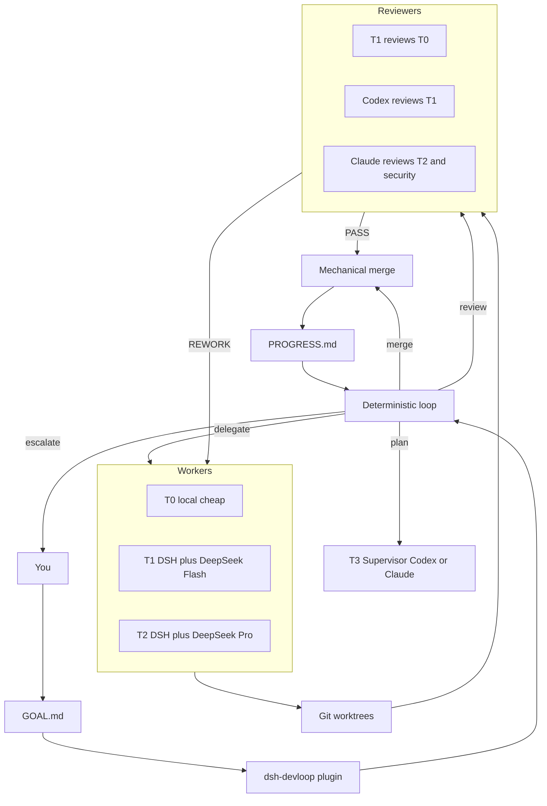

# Design

DevLoop is a DeepSeek Harness plugin that runs an engineering team: expensive models judge, cheap models implement, a program loop keeps the factory running.

This document is the architecture view. Requirements live in [Solution.md](./Solution.md). Decisions live in [adr/](./adr/). Delivery slices live in [Plan.md](./Plan.md).

## Positioning

```text
DeepSeek Harness          = Agent Runtime (session, tools, models, sandbox, UI)
dsh-devloop (this repo)   = Engineering Workflow plugin
dsh-devflow               = community reference (winner), not a dependency
Claude / Codex            = T3 Supervisor / Reviewer adapters
DeepSeek (via DSH)        = default T1/T2 Worker
```

We do not ship another coding agent. We ship the missing scheduler: **the right role, at the right time, with a bounded task, under a budget**.

## System shape



The outer loop is a program. One tick does at most one state transition, then writes `.devloop/STATE.json` and exits that beat.

## Domain objects

| Object | Owner | Meaning |
|---|---|---|
| Goal | Human or T3 | Desired outcome, success, constraints, non-goals. Workers cannot edit. |
| Plan | T3 | Milestones derived from Goal |
| Task | T3 via `/plan` | Bounded unit with tier, risk, acceptance, path allowlist |
| Task Contract | `/delegate` | What a worker may touch, how to pass, budget, forbidden paths |
| Review | Higher tier than implementer | PASS / REWORK / REPLAN / BLOCKED |
| Run | Loop | One worker attempt in a worktree with a fresh agent session |
| Budget | Plugin | Hard stop on time, attempts, tokens, cost, no-progress |

DSH `Goal` (session-scoped agent objective) is a different object. We may later *drive* DSH goals from a Task; we do not reuse that word for the project Goal.

## Control vs execution

```mermaid
sequenceDiagram
    participant Loop as Program loop
    participant Plan as T3 plan
    participant Worker as T1 or T2 worker
    participant Review as Higher-tier reviewer
    participant Git as Worktree and merge

    Loop->>Loop: decideNextAction(state) no LLM
    alt plan needed
        Loop->>Plan: produce tasks and contracts
        Plan-->>Loop: TASKS.json
    else ready task
        Loop->>Git: add worktree
        Loop->>Worker: headless one-shot with contract
        Worker-->>Loop: diff plus test result
        Loop->>Review: cannot be the implementer
        Review-->>Loop: verdict
        alt PASS
            Loop->>Git: rebase test merge
        else REWORK
            Loop->>Worker: retry or escalate tier
        end
    end
    Loop->>Loop: persist STATE and progress
```

## Plugin boundary

The package is a DSH **bundle**:

```text
package.json          dsh.bundle.patch
cordis.patch.yml      insert id: devloop, name: dsh-devloop
src/index.ts          Cordis plugin (Service + Config schema)
```

Install:

```bash
dsh plugin --profile web add /path/to/DevLoop
```

Harness source stays untouched. Optional later adapters (OpenCode, Claude CLI, Codex exec) sit behind one `AgentBackend` interface; 0.1 only implements the in-process loop plus DSH-native model routing config.

## What 0.1 includes vs defers

Includes:

- Domain types, file-backed `.devloop/` state
- Deterministic `decideNextAction`
- Budget / circuit breaker evaluation
- Tier router and review-tier policy
- Loadable DSH plugin with a tick that records the next action

Defers:

- Spawning real DSH / OpenCode / Claude / Codex processes
- Worktree pool and merge script
- Web UI
- LiteLLM gateway
- Claude Code Router
- SQLite history

Those deferred pieces are named so later stages do not quietly expand 0.1.

## Local model note

On a 64GB Apple Silicon machine, 24×7 T0 should prefer a small coder (about 7B) or a MoE coder with few active parameters. A 27B dense Q6 is a T1+ local option, not the always-on janitor. Exact weights are configuration, not code.

## Safety stance

24×7 is allowed only because the loop can stop. Kill switch, per-task timeout, attempt cap, daily spend cap, duplicate-action detection, and supervisor escalation are part of the design, not an operations afterthought. See [ADR-0008](./adr/0008-budget-circuit-breaker-first.md).
